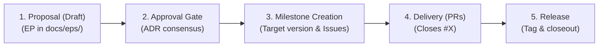

# Enhancement Proposal (EP) Workflow

This workflow provides a structured process for research software engineering. It ensures **traceability across research sessions**, allowing you to pause, resume, and ground code changes directly in scientific requirements.

## 1. The 5-Stage Collaborative Lifecycle



1. **Proposal (Draft):** Author the EP in `docs/eps/ep-<N>-<title>.md` defining requirements and trade-offs (`ADR-1`, `ADR-2`).
2. **Approval Gate:** Reach agreement on architectural decisions and update status to `Approved`.
3. **Milestone Creation:** Assign the delivery plan into discrete GitHub Issues under a GitHub Milestone (e.g. `v0.7.0: Core Modernization (EP-1)`).
4. **Delivery via PRs:** Open bite-sized PRs referencing `Closes #X`. GitHub automatically tracks progress and closes issues upon merge.
5. **Release & Closeout:** When the milestone reaches 100%, tag the release version, close the milestone, and update the EP status to `Implemented`.

---

## Standard EP Template

Save each proposal in `docs/eps/ep-<N>-<title>.md` using this format:

```markdown
# EP-1: [Feature / Enhancement Title]

* **Author:** [Author Name]
* **Status:** [Draft / In Discussion / Approved / In Progress / Completed]
* **Target Version:** [e.g. RFL v0.7.0]
* **Date:** YYYY-MM-DD

---

## 1. Motivation, Goals & Non-Goals
* **Problem Statement:** What physics, mathematics, or computational bottleneck is being addressed?
* **Goals:** What will this feature enable you to do in your research?
* **Non-Goals:** What is explicitly out of scope for this iteration?

## 2. Research Workflows & Scientific Requirements
* **Core Research Scenarios:** How you will interact with this code (e.g. interactive Jupyter exploration, long batch MCMC runs).
* **Requirements & Invariants Table:** Quantifiable physical and mathematical constraints (e.g. Hermiticity preservation, spectral symmetry $\lambda \leftrightarrow -\lambda$, energy conservation).

## 3. Architecture Decision Records (ADRs) & Trade-offs
* **Options Considered:** 2–3 distinct architectural or mathematical approaches for each subsystem.
* **Pros & Cons Matrix:** Evaluating options against performance, memory overhead, API ergonomics, and mathematical stability.
* **Selected Decision & Rationale:** Clear justification for the chosen design.

## 4. Target Architecture & Component Contracts
* **Subsystem Architecture:** Concrete class declarations, value types, and file organization.
* **Python Interoperability:** Zero-copy buffer views, iterator streams, and NumPy integration.

## 5. Verification Matrix & Benchmarks
* Automated unit tests and invariant benchmarks mapped directly to Requirement IDs.

## 6. Phased Delivery Plan
* Bite-sized, self-contained implementation tasks with clear commit boundaries.
```
