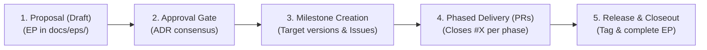

# Enhancement Proposal (EP) Workflow

This workflow provides a structured process for research software engineering. It ensures **traceability across research sessions**, allowing you to pause, resume, and ground code changes directly in scientific requirements.

## 1. The 5-Stage Collaborative Lifecycle



1. **Proposal (Draft):** Author the EP in `docs/eps/ep-<N>-<title>.md` defining requirements and trade-offs (`ADR-1`, `ADR-2`).
2. **Approval Gate:** Reach agreement on architectural decisions and update status to `Accepted`.
3. **Milestone Creation:** Decompose the delivery plan into discrete phases assigned to specific **GitHub Milestones** (e.g. Phase 1 $\to$ `v0.5.0`, Phase 2 $\to$ `v0.7.0`).
4. **Phased Delivery via PRs:** Deliver phases in bite-sized PRs referencing `Closes #X`. Track phase progress in the EP tracker table.
5. **Release & Closeout:** When a milestone reaches 100%, tag the release. When all phases are shipped, update the EP status to `Completed`.

---

## 2. Multi-Version & Multi-Phase Tracking Standard

When an Enhancement Proposal spans multiple releases:
* **Status Field:** Set to `Accepted (In Progress)` during active development. Update to `Completed` only when all planned phases ship.
* **Target Versions:** List all target versions explicitly: `Target Versions: RFL v0.5.0 (Phase 1), v0.7.0 (Phase 2), Backlog (Phase 3)`.
* **Implementation Tracker Table:** Include a dedicated phase tracking table at the top of the EP (Section 1) linking each phase to its milestone, issue, PR, and live status.

---

## 3. Standard EP Template

Save each proposal in `docs/eps/ep-<N>-<title>.md` using this format:

```markdown
# EP-<N>: [Feature / Enhancement Title]

* **Title:** [Feature / Enhancement Title]
* **Author:** [Author Name]
* **Status:** [Draft / In Discussion / Accepted / In Progress / Completed]
* **Target Versions:** [e.g. RFL v0.5.0 (Phase 1), v0.7.0 (Phase 2)]
* **Date:** YYYY-MM-DD

---

## 1. Multi-Phase Implementation Tracker

| Phase | Scope & Deliverables | Target Version | Milestone | PR / Issue | Status |
| :--- | :--- | :--- | :--- | :--- | :--- |
| **Phase 1** | [Deliverables summary] | `v0.5.0` | [`v0.5.0`](...) | [PR #X](...) (Closes [#Y](...)) | ✅ Implemented |
| **Phase 2** | [Deliverables summary] | `v0.7.0` | [`v0.7.0`](...) | [#Z](...) | ⏳ Scheduled |

---

## 2. Motivation, Goals & Non-Goals
* **Problem Statement:** What physics, mathematics, or computational bottleneck is being addressed?
* **Goals:** What will this feature enable you to do in your research?
* **Non-Goals:** What is explicitly out of scope for this iteration?

## 3. Research Workflows & Scientific Requirements
* **Core Research Scenarios:** How you will interact with this code (e.g. interactive Jupyter exploration, long batch MCMC runs).
* **Requirements & Invariants Table:** Quantifiable physical and mathematical constraints (e.g. Hermiticity preservation, spectral symmetry $\lambda \leftrightarrow -\lambda$, energy conservation).

## 4. Architecture Decision Records (ADRs) & Trade-offs
* **Options Considered:** 2–3 distinct architectural or mathematical approaches for each subsystem.
* **Pros & Cons Matrix:** Evaluating options against performance, memory overhead, API ergonomics, and mathematical stability.
* **Selected Decision & Rationale:** Clear justification for the chosen design.

## 5. Target Architecture & Component Contracts
* **Subsystem Architecture:** Concrete class declarations, value types, and file organization.
* **Python Interoperability:** Zero-copy buffer views, iterator streams, and NumPy integration.

## 6. Verification Matrix & Benchmarks
* Automated unit tests and invariant benchmarks mapped directly to Requirement IDs.

## 7. Phased Delivery Plan
* Bite-sized, self-contained implementation tasks with clear commit boundaries.
```
