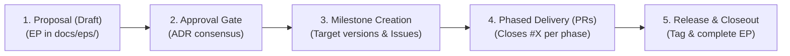

# Enhancement Proposal (EP) Workflow

This workflow provides a structured process for research software engineering. It ensures **traceability across research sessions**, allowing you to pause, resume, and ground code changes directly in scientific requirements.

## 1. The 5-Stage Collaborative Lifecycle

1. **Proposal (Draft):** Author the EP in `docs/eps/ep-<N>-<title>.md` defining requirements and trade-offs (`ADR-1`, `ADR-2`).
2. **Approval Gate:** Reach agreement on architectural decisions and update status to `Accepted`.
3. **Milestone Creation:** Decompose the delivery plan into discrete phases assigned to specific **GitHub Milestones** (e.g. Phase 1 → `v0.1.0`, Phase 2 → `v0.3.0`).
4. **Phased Delivery via PRs:** Deliver phases in bite-sized PRs referencing `Closes #X`. Track phase progress in the EP tracker table.
5. **Release & Closeout:** When a milestone reaches 100%, tag the release. When all phases are shipped, update the EP status to `Completed`.

---

## 2. Multi-Version & Multi-Phase Tracking Standard

When an Enhancement Proposal spans multiple releases:
* **Status Field:** Set to `Accepted (In Progress)` during active development. Update to `Completed` only when all planned phases ship.
* **Target Versions:** List all target versions explicitly: `Target Versions: RFL v0.1.0 (Phase 1), v0.3.0 (Phase 2), Backlog (Phase 3)`.
* **Implementation Tracker Table:** Include a dedicated phase tracking table at the top of the EP (Section 1) linking each phase to its milestone, issue, PR, and live status.

## 3. Canonical EP Template

The single source of truth for authoring new Enhancement Proposals is:
📄 **[docs/eps/ep-template.md](docs/eps/ep-template.md)**

When authoring a new proposal:
1. Copy `docs/eps/ep-template.md` to `docs/eps/ep-<N>-<title>.md`.
2. Populate all sections according to the research scope.
3. Maintain controlled language compliance as defined in the `technical-writing` skill and [docs/Glossary.md](docs/Glossary.md).
