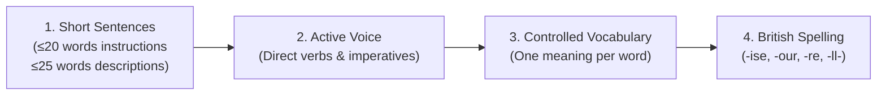

# Technical Writing & Controlled Language Guide

This guide defines the writing rules for RFL documentation, code comments, docstrings, and research notes. It adapts the international **ASD-STE100** specification with **British English spelling**.

> [!IMPORTANT]
> The single source of truth for approved terms and their definitions is **[docs/Glossary.md](file:///Users/paul/Dev/RFL/docs/Glossary.md)**. Always check the glossary to maintain the "one word for one concept" rule.

---

## 1. Core Principles

Controlled writing ensures clarity, reduces ambiguity, and makes technical documentation easy to read for humans and AI agents.



---

## 2. The 8 Core Writing Rules

### Rule 1: Sentence Length Limits
* **Procedural steps & instructions:** Maximum **20 words** per sentence.
* **Descriptive text & explanations:** Maximum **25 words** per sentence.
* Keep one main idea per sentence.

### Rule 2: Use the Active Voice
* **Do not write (Passive):** *"The Dirac operator matrices are updated by the Metropolis algorithm."*
* **Write (Active):** *"The Metropolis algorithm updates the Dirac operator matrices."*

### Rule 3: Use Direct Imperative Verbs for Instructions
* **Do not write:** *"You should run the tests using ctest."*
* **Write:** *"Run the tests with `ctest`."*

### Rule 4: Avoid Complex Noun Clusters
* Limit noun sequences to a maximum of **3 nouns**.
* **Do not write:** *"Finite noncommutative geometry Dirac operator matrix element variation."* (7 nouns)
* **Write:** *"Variation of a matrix element in the finite NCG Dirac operator."*

### Rule 5: One Meaning per Word (No Ambiguous Conjunctions)
* Use **`because`** (not *as* or *since*) when giving a reason.
* Use **`after`** / **`when`** (not *as* or *since*) for time relationships.
* Use **`to`** (not *in order to*).
* Use **`must`** (not *shall*, *should*, or *ought to*) for mandatory requirements.

### Rule 6: Use Approved Verbs over Vague Words
| Vague / Unapproved | Approved Replacement | Example |
| :--- | :--- | :--- |
| *carry out / perform / conduct* | **do / run / execute / calculate** | *"Run the simulation."* (not *"Carry out the simulation."*) |
| *utilize / leverage* | **use** | *"Use Armadillo for matrix math."* |
| *terminate* | **stop / end / cancel** | *"Stop the iteration."* |
| *facilitate* | **help / enable / provide** | *"This method enables fast lookup."* |
| *via* | **with / through / using** | *"Sample using Metropolis."* |

### Rule 7: Avoid Continuous (-ing) Tenses in Procedures
* Prefer simple present or imperative over present continuous.
* **Do not write:** *"When running the sampler, it is recording eigenvalues."*
* **Write:** *"When the sampler runs, it records eigenvalues."*

---

## 3. British English Spelling Conventions

RFL strictly standardizes on **British English**:

| Feature | British Standard (Approved) | US Form (Avoid) |
| :--- | :--- | :--- |
| **-ise / -isation** | *initialise, randomise, optimise, diagonalisation, categorise* | *initialize, randomize, optimize, diagonalization* |
| **-our** | *behaviour, colour, neighbour* | *behavior, color, neighbor* |
| **-re** | *centre, metre, fibre* | *center, meter, fiber* |
| **Double 'l'** | *modelling, initialised, cancelled, travelling* | *modeling, initialized, canceled, traveling* |
| **-programme** | *programme* (for scientific initiatives), *program* (for computer code) | *program* |
| **-ence / -ense** | *licence* (noun), *license* (verb); *defence* | *license* (both); *defense* |
| **Specialized terms** | *gauge, analogue, catalogue* | *gage, analog, catalog* |

---

## 4. Technical Writing Examples (Before vs. After)

### Example 1: Code Docstrings
* ❌ **Before:**
  ```cpp
  // This method is utilized in order to carry out the calculation of the trace of the fourth power 
  // of the Dirac operator which is needed since we want to evaluate the Barrett-Glaser action.
  ```
* ✅ **After (ASD-STE100 + British):**
  ```cpp
  /**
   * Calculates the trace of the fourth power of the Dirac operator, Tr(D^4).
   * The Barrett-Glaser action uses this trace to evaluate energy.
   *
   * @return The trace value as a double.
   */
  ```

### Example 2: Architecture Documentation
* ❌ **Before:**
  ```markdown
  Since the previous implementation was utilizing dynamic polymorphism with unique_ptr wrappers, 
  in order to achieve optimal computational performance we are refactoring the state into regular value types.
  ```
* ✅ **After (ASD-STE100 + British):**
  ```markdown
  The previous implementation used dynamic polymorphism with `std::unique_ptr` wrappers.
  To achieve optimal computational performance, we refactor the state into regular value types.
  ```
