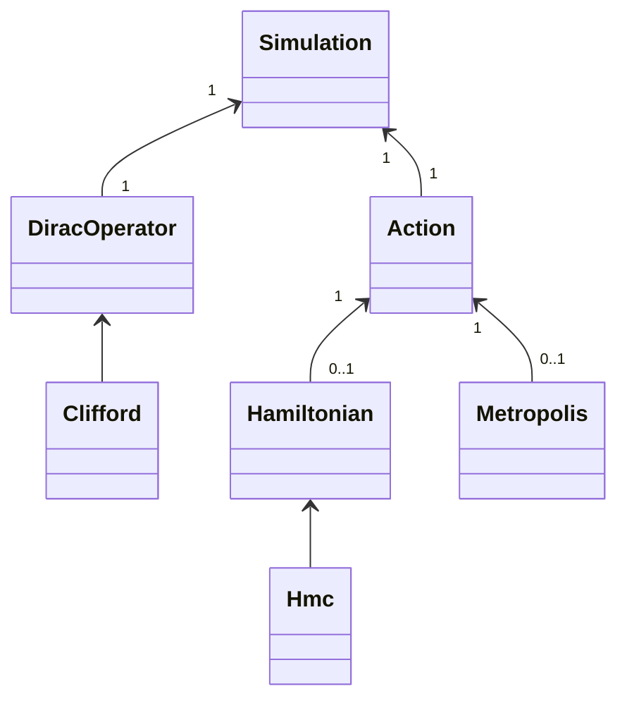

# New RFL Documentation

This directory contains the source code for the RFL library.

TODO: Enable mermaid rendering for Doxygen by following: https://github.com/tttapa/doxygen-mermaid

```mermaid
classDiagram
    class Action{
    }
    class Clifford
    class DiracOperator
    class Hamiltonian
    class Hmc
    class Metropolis
    class Simulation
    
    Simulation "1" <-- "1"Action
    Action "1" <-- "0..1" Metropolis
    Action "1" <-- "0..1" Hamiltonian
    Simulation "1" <-- "1" DiracOperator
    DiracOperator <-- Clifford
    Hamiltonian <-- Hmc
    
    
```