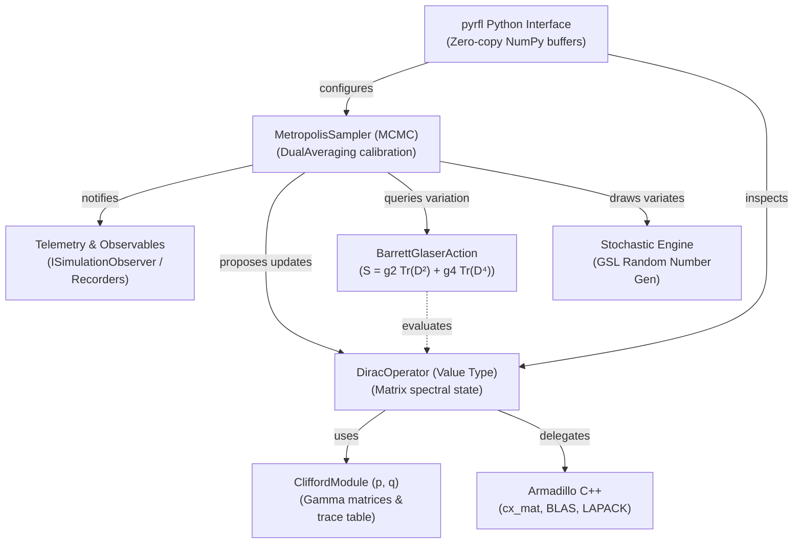
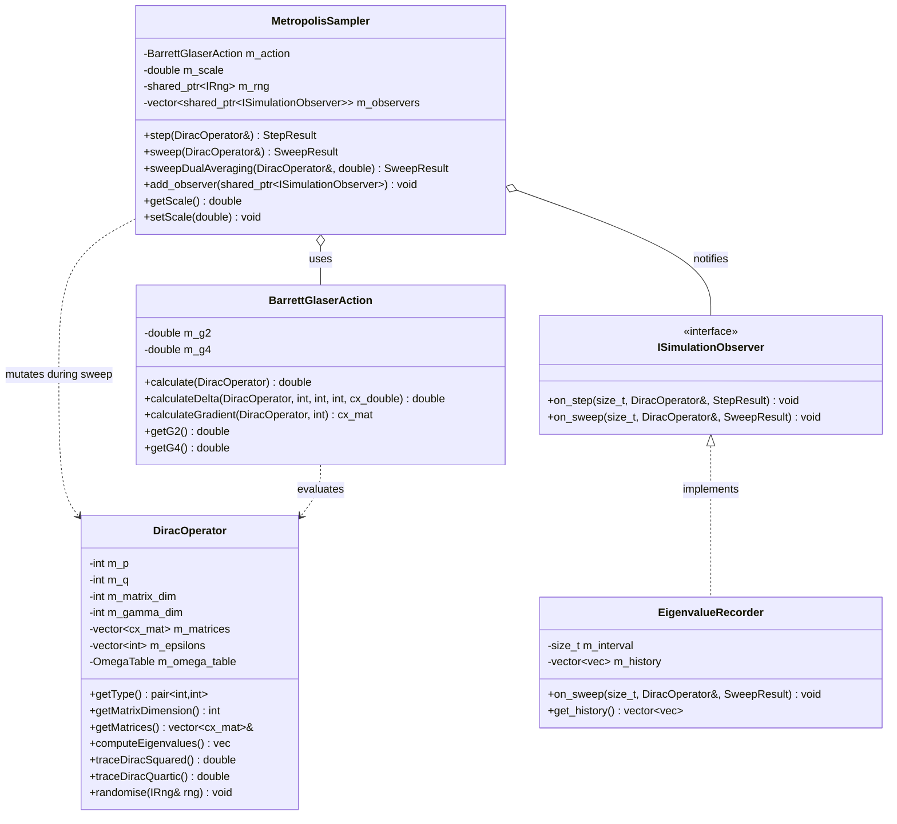

# RFL Target Architecture & Library Design Guide

## 1. Vision & Core Philosophy

`RFL` (Random Fuzzy Library) is a high-performance C++17/20 scientific library with native Python bindings designed for simulating and analysing **Finite Noncommutative Geometries (Finite NCGs)**, **Fuzzy Spaces**, and **Random Spectral Triples**.

### The Library Design Principle
> *"Libraries provide mechanisms, vocabulary, and data structures; Applications provide policies, workflows, and orchestration."*

> [!NOTE]
> For the complete research-driven enhancement proposal, design alternatives trade-offs, and verification matrix, see **[EP-1: Research-Driven Architecture Modernisation for RFL](eps/ep-1-core-architecture-modernisation.md)**.

---

## 2. System Architecture & Data Flow



| Architectural Layer | Core Responsibilities | Key Components |
| :--- | :--- | :--- |
| **Research & Exploration** | User API, interactive exploration, telemetry sinks | `pyrfl` Python module, `ISimulationObserver`, `EigenvalueRecorder` |
| **Sampling & Optimisation** | Markov chain steppers, step calibration | `MetropolisSampler`, `DualAveraging`, symplectic integrators |
| **Noncommutative Geometry** | Matrix spectral state, Clifford algebra representations | `DiracOperator`, `CliffordModule`, `OmegaTable` |
| **Foundational Math** | High-performance matrix linear algebra and stochastic RNG | Armadillo (`arma::cx_mat`), BLAS, LAPACK, GSL RNG |

### Architectural Principles:
* **Value Semantics & Regular Types:** Domain objects (`DiracOperator`, `CliffordModule`, `ActionConfig`) behave as regular C++ types: copyable, movable, default-constructible where sensible, with intuitive value equality and no nested pointer wrappers.
* **Separation of State, Energy, and Algorithm:** The geometry state owns matrices, the action functional evaluates energy and derivatives, and samplers execute Markov transitions.
* **Stepper / Iterator Pattern:** Callers retain 100% control over the execution loop for logging, checkpointing, and real-time visualisation.
* **Static Polymorphism in Hot Loops:** Inner Markov sweeps use templates/concepts to enable compiler inlining, register allocation, and SIMD vectorisation.
* **Dual-Citizen C++/Python Architecture:** C++ compute core delivers raw execution speed; Python provides research agility with zero-copy NumPy array buffers.

---

## 3. Structural Design Patterns

| Design Pattern | Subsystem | Architecture Intent | Modern C++ Implementation |
| :--- | :--- | :--- | :--- |
| **Physical Isolation (Pitchfork)** | Codebase Layout | Hide private kernels from public consumers | Public headers in `include/rfl/`; internal kernels in `src/detail/` |
| **Policy-Based Design** | Simulation Core | Compile-time pluggable physics without virtual dispatch | Template policies for action functionals, proposals, and tuning |
| **Observer / Event Sink** | Telemetry & Observables | Decouple telemetry from Markov chain steppers | `ISimulationObserver` interface with callback hooks (`on_step`, `on_sweep`) |
| **Parameter Objects** | Configuration | Type-safe, designated-initializer configuration | Strongly-typed structs (`GeometryConfig`, `MetropolisConfig`) |
| **Dual-Tier Python Bridge** | Language Interop | High-performance compute with Python research agility | `pybind11` binding zero-copy NumPy buffers and Pythonic generators |
| **Non-Virtual Interface (NVI)** | Public Interfaces | Enforce preconditions and invariants reliably | Public non-virtual methods delegating to private virtual customisation hooks |

### Pattern Descriptions:

* **Physical Isolation (Pitchfork Layout):**
  * `include/rfl/`: Public headers (`dirac_operator.hpp`, `action.hpp`, `metropolis.hpp`).
  * `src/detail/`: Internal helper math kernels, Clifford generator lookup tables, and low-level indexing routines.
* **Policy-Based Class Design:**
  Decomposes algorithms into compile-time pluggable policies (`ActionPolicy`, `ProposalPolicy`, `TuningPolicy`), eliminating virtual dispatch in hot loops.
* **Observer / Event Sink Pattern:**
  Decouples measurement collection from simulation algorithms (`ISimulationObserver`, `EigenvalueRecorder`, `AutocorrelationCollector`).
* **Parameter Objects:**
  Groups related configuration parameters into strongly-typed structs with default values (`GeometryConfig`, `MetropolisConfig`).
* **Dual-Tier Python Bridge:**
  Exposes C++ value types as idiomatic Python classes with generator streams (`iter_sweeps()`) and zero-copy NumPy array integration.
* **Non-Virtual Interface (NVI):**
  Public non-virtual methods enforce invariants and preconditions before delegating to private virtual customisation points.

---

## 4. Component Structure & Relationships



| Component Class | Architectural Role | Key Responsibilities |
| :--- | :--- | :--- |
| **`DiracOperator`** | Spectral State | Value-type owning matrix elements $H_i, L_{ij}$, Clifford module, and eigenvalue spectra |
| **`BarrettGlaserAction`** | Energy Functional | Calculates action $S(D) = g_2 \text{Tr}(D^2) + g_4 \text{Tr}(D^4)$ and analytic variations $\Delta S$ |
| **`MetropolisSampler`** | MCMC Stepper | Drives Markov chain updates, tunes step sizes via dual averaging, and notifies observers |
| **`ISimulationObserver`** | Telemetry Interface | Observer sink receiving `on_step()` and `on_sweep()` lifecycle events |
| **`EigenvalueRecorder`** | Metric Collector | Collects spectral histories and observables across simulation sweeps |

---

## 5. Target Component APIs

### 5.1 Geometry Layer: `DiracOperator` (Value Type)

```cpp
namespace rfl {

class DiracOperator {
public:
  // Constructors
  DiracOperator(int p, int q, int matrix_dim);
  
  // Rule of Zero / Five (Value semantics)
  DiracOperator(const DiracOperator& other) = default;
  DiracOperator(DiracOperator&& other) noexcept = default;
  DiracOperator& operator=(const DiracOperator& other) = default;
  DiracOperator& operator=(DiracOperator&& other) noexcept = default;
  ~DiracOperator() = default;

  // Geometric & Algebraic Properties (const)
  std::pair<int, int> getType() const noexcept { return {m_p, m_q}; }
  int getMatrixDimension() const noexcept { return m_matrix_dim; }
  int getGammaDimension() const noexcept { return m_gamma_dim; }
  int getNumMatrices() const noexcept { return m_num_matrices; }
  const std::vector<int>& getEpsilons() const noexcept { return m_epsilons; }

  // Matrix Accessors (Const & Mutable overloads)
  const std::vector<arma::cx_mat>& getMatrices() const noexcept { return m_matrices; }
  std::vector<arma::cx_mat>& getMatrices() noexcept { return m_matrices; }
  const arma::cx_mat& getMatrix(size_t index) const { return m_matrices.at(index); }
  arma::cx_mat& getMatrix(size_t index) { return m_matrices.at(index); }

  // Spectral Computations
  arma::cx_mat assembleFullDiracMatrix() const;
  arma::vec computeEigenvalues() const;
  double traceDiracSquared() const;
  double traceDiracQuartic() const;

  // Randomisation
  void randomise(IRng& rng);

private:
  int m_p{0};
  int m_q{0};
  int m_matrix_dim{0};
  int m_gamma_dim{0};
  int m_num_matrices{0};
  
  std::vector<int> m_epsilons;
  std::vector<arma::cx_mat> m_matrices;
  CliffordModule m_clifford;
  OmegaTable m_omega_table; // Precomputed Clifford products Tr(γ_a γ_b γ_c γ_d)
};

} // namespace rfl
```

---

### 5.2 Physics Layer: `BarrettGlaserAction`

```cpp
namespace rfl {

class BarrettGlaserAction {
public:
  BarrettGlaserAction(double g2, double g4) noexcept : m_g2(g2), m_g4(g4) {}

  // Action Evaluation
  double calculate(const DiracOperator& dirac) const;

  // Fast Local Variation ΔS = S(D + δD) - S(D) for single matrix element perturbation
  double calculateDelta(const DiracOperator& dirac,
                        int matrix_idx,
                        int row,
                        int col,
                        const arma::cx_double& perturbation) const;

  // Fast Gradient ∇_M S(D) for HMC / Langevin dynamics
  arma::cx_mat calculateGradient(const DiracOperator& dirac, int matrix_idx) const;

  // Parameter Getters / Setters
  double getG2() const noexcept { return m_g2; }
  double getG4() const noexcept { return m_g4; }
  void setParams(double g2, double g4) noexcept { m_g2 = g2; m_g4 = g4; }

private:
  double m_g2;
  double m_g4;
  
  double deltaTrD2(const DiracOperator& dirac, int matrix_idx, int r, int c, const arma::cx_double& z) const;
  double deltaTrD4(const DiracOperator& dirac, int matrix_idx, int r, int c, const arma::cx_double& z) const;
};

} // namespace rfl
```

---

### 5.3 Sampling Layer: Steppers & Observers

```cpp
namespace rfl {

struct StepResult {
  bool accepted{false};
  double delta_action{0.0};
  double current_action{0.0};
};

struct SweepResult {
  int total_proposals{0};
  int accepted_proposals{0};
  double acceptance_rate{0.0};
};

class ISimulationObserver {
public:
  virtual ~ISimulationObserver() = default;
  virtual void on_step(size_t step_idx, const DiracOperator& dirac, const StepResult& res) {}
  virtual void on_sweep(size_t sweep_idx, const DiracOperator& dirac, const SweepResult& res) {}
};

class MetropolisSampler {
public:
  MetropolisSampler(BarrettGlaserAction action, double scale, std::shared_ptr<IRng> rng);

  // Single elemental step
  StepResult step(DiracOperator& dirac);

  // Full sweep over all matrix degrees of freedom
  SweepResult sweep(DiracOperator& dirac);

  // Dual averaging calibration step for automatic step-size tuning
  SweepResult sweepDualAveraging(DiracOperator& dirac, double target_acceptance = 0.65);

  // Observer telemetry registration
  void add_observer(std::shared_ptr<ISimulationObserver> observer);

  // Scale management
  double getScale() const noexcept { return m_scale; }
  void setScale(double scale) noexcept { m_scale = scale; }

private:
  BarrettGlaserAction m_action;
  double m_scale;
  std::shared_ptr<IRng> m_rng;
  std::vector<std::shared_ptr<ISimulationObserver>> m_observers;
};

} // namespace rfl
```

#### User Consumption Pattern (C++):
```cpp
// Caller maintains full control of the experiment loop
rfl::DiracOperator dirac(1, 3, 10);
rfl::BarrettGlaserAction action(-1.5, 1.0);
rfl::MetropolisSampler sampler(action, 0.05, std::make_shared<rfl::GslRng>(42));

// Attach observer for automated recording
auto recorder = std::make_shared<rfl::EigenvalueRecorder>(/*interval=*/10);
sampler.add_observer(recorder);

// Burn-in / Thermalisation with dual averaging
for (int i = 0; i < 500; ++i) {
  sampler.sweepDualAveraging(dirac, 0.65);
}

// Production sampling
for (int sweep = 0; sweep < 2000; ++sweep) {
  sampler.sweep(dirac);
}
```

---

## 6. Python API & Ecosystem Interop

The Python bindings expose the same clean, non-blocking stepper vocabulary:

```python
import rfl
import numpy as np

# 1. Initialise spectral geometry and physics action
dirac = rfl.DiracOperator(p=1, q=3, matrix_dim=10)
action = rfl.BarrettGlaserAction(g2=-2.0, g4=1.0)
rng = rfl.GslRng(seed=12345)
sampler = rfl.MetropolisSampler(action=action, scale=0.05, rng=rng)

# 2. Thermalise
for _ in range(500):
    sampler.sweep_dual_averaging(dirac, target_acceptance=0.65)

# 3. Measurement Loop with generator streaming
eigenvalues_history = []
for sweep_idx, result in enumerate(sampler.iter_sweeps(dirac, sweeps=1000)):
    if sweep_idx % 10 == 0:
        # Zero-copy conversion to NumPy 1D array
        evs = dirac.compute_eigenvalues()
        eigenvalues_history.append(evs)

eigenvalues_array = np.array(eigenvalues_history)
```

---

## 7. Performance & Memory Management Strategy

1. **Stack Allocations in Hot Kernels:**
   Replace temporary dynamic allocations (e.g. `new double[2]`) in MCMC sweeps with `std::array<double, 2>`.
2. **Contiguous Buffer for Clifford Products:**
   The 4-matrix trace table $\Omega^{(4)}_{abcd} = \text{Tr}(\gamma_a \gamma_b \gamma_c \gamma_d)$ is precomputed during geometry initialisation into a flat contiguous `std::vector<std::complex<double>>` with index arithmetic:
   $$\text{idx}(a, b, c, d) = a + N(b + N(c + N d))$$
3. **OpenMP Parallelisation:**
   - Multi-chain simulation parallelism: Run $K$ independent Dirac Markov chains across threads without mutex locks (each chain has an independent RNG state).
   - Trace and eigenvalue computation vectorisation with Armadillo / LAPACK bindings.

---

## 8. Migration Roadmap

| Phase | Objective | Key Deliverables |
| :--- | :--- | :--- |
| **Phase 1** | **Value Semantics & Clean Types** | Remove `unique_ptr` container wrappers from `DiracOperator`; enforce strict `const` correctness; deprecate leaky `IDiracOperator` fat interface. |
| **Phase 2** | **Action / Kernel Decoupling** | Extract $\Delta S$ trace formulas from `Metropolis.cpp` into `BarrettGlaserAction`; standardise `calculateDelta` and `calculateGradient`. |
| **Phase 3** | **Modular Stepper & Observer API** | Implement `MetropolisSampler::sweep()` and `ISimulationObserver`; replace monolithic `Simulation` runner. |
| **Phase 4** | **Python Bindings & NumPy Views** | Expose new stepper API and generator iterators in `src/RFL/python_bindings/bindings.cpp`. |
| **Phase 5** | **Observables & Advanced Solvers** | Implement integrated autocorrelation time estimator and Hybrid Monte Carlo (HMC) sampler using gradients. |
