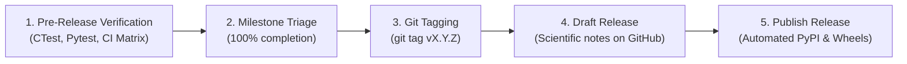

# RFL Release Process & Scientific Release Notes Guide

This document establishes the official release lifecycle, quality gates, and release notes writing standard for the `RFL` (Random Fuzzy Library) project.

---

## 1. Release Philosophy & Governance

1. **Semantic Versioning:** Releases follow `vMAJOR.MINOR.PATCH` (e.g. `v0.5.0`).
   - **MAJOR:** Breaking API or mathematical state changes.
   - **MINOR:** New physical observables, solvers, platforms, or packaging enhancements.
   - **PATCH:** Bug fixes, performance optimisations, or documentation updates.
2. **Controlled Language (ASD-STE100 & British English):**
   - Release documentation must follow controlled vocabulary defined in [docs/Glossary.md](Glossary.md).
   - Use British English spelling (*standardisation*, *optimisation*, *behaviour*, *modelling*).
3. **Impersonal Scientific Tone:**
   - Write in an objective, third-person perspective.
   - Do not use first-person pronouns (*"we"*, *"I"*, *"our"*).
   - Avoid conversational openings (e.g. *"We are pleased to announce..."*).

---

## 2. The 5-Step Release Lifecycle



### Step 1: Pre-Release Verification (Quality Gates)
Before initiating a release, ensure all quality gates pass locally and on GitHub Actions:
- **CTest Suite:** `ctest --test-dir build --output-on-failure` (100% pass).
- **Pytest Suite:** `pytest src/RFL/python_bindings/tests` (100% pass).
- **Please Hermetic Build:** `./pleasew test //...` (100% pass).
- **CI Matrix:** All GitHub Actions workflows on `main` must be green.

### Step 2: Milestone Triage & EP Status
- Verify that all GitHub Issues and PRs for the milestone are merged and closed.
- Update the relevant Enhancement Proposal in [docs/eps/](eps/) to mark the phase as `✅ Implemented`.

### Step 3: Git Tagging
Create and push an annotated git tag pointing to the release commit on `main`:
```bash
git checkout main
git pull origin main
git tag vX.Y.Z
git push origin vX.Y.Z
```

> [!NOTE]
> Pushing a tag alone will **not** publish packages or trigger PyPI deployments. The release workflow triggers only when a GitHub Release is published.

### Step 4: Create a Draft Release
Create a draft release on GitHub referencing the new tag. You can prepare and review the release notes safely in draft mode:

```bash
gh release create vX.Y.Z --draft --title "vX.Y.Z: <Release Title>" --notes-file release_notes.md
```

### Step 5: Publish Release & Automated Distribution
Click **"Publish release"** in GitHub (or run `gh release edit vX.Y.Z --draft=false`).
The `.github/workflows/release.yml` pipeline will automatically:
1. Compile multi-platform binary wheels for Linux (`manylinux_2_28_x86_64`) and macOS (`x86_64`, Apple Silicon `arm64`) across Python 3.8–3.13.
2. Execute the test suite inside clean wheel environments.
3. Package the source distribution archive (`sdist`).
4. Attach all compiled wheels and `sdist` tarballs to the GitHub Release.
5. Publish packages to PyPI using OpenID Connect (OIDC) Trusted Publishing.
6. Close the GitHub Milestone.

---

## 3. Release Notes Template

When drafting release notes, use the standard scientific blueprint below:

```markdown
# RFL vX.Y.Z Release Notes

RFL version X.Y.Z introduces [one declarative sentence summarizing the release].

---

## 1. Highlights

* **[Highlight 1]:** [Brief technical description].
* **[Highlight 2]:** [Brief technical description].
* **[Highlight 3]:** [Brief technical description].

---

## 2. Packaging & Distribution

* [Detail packaging, wheel, or build system updates].
* [Detail package manager or installation improvements].

---

## 3. Python Bindings & Performance

* [Detail pybind11, NumPy zero-copy interop, or observable streaming updates].

---

## 4. Physics & Simulation Core

* [Detail DiracOperator, Action, Stepper, or Sampler enhancements].

---

## 5. Documentation & Governance

* [Detail EPs, specifications, or architectural documentation].

---

## 6. Compatibility & Verification

* **C++ Standard:** C++17 conforming compiler (GCC ≥ 10, Clang ≥ 11, Apple Clang ≥ 13, MSVC ≥ 2019).
* **Linear Algebra:** Armadillo ≥ 11.4.0, OpenBLAS / LAPACK.
* **Stochastic Engine:** GNU Scientific Library (GSL) ≥ 2.6.
* **Python Compatibility:** Python 3.8 – 3.13, NumPy ≥ 1.22.
* **Quality Gates:** 100% test pass rate across CTest, Pytest, and CI matrix configurations.
```

---

## 4. Testing the Release Pipeline (Dry Run)

To test wheel compilation and packaging without uploading to PyPI or modifying release assets, trigger a manual dry run:

```bash
gh workflow run release.yml -f dry_run=true -f publish_to_pypi=false
```
