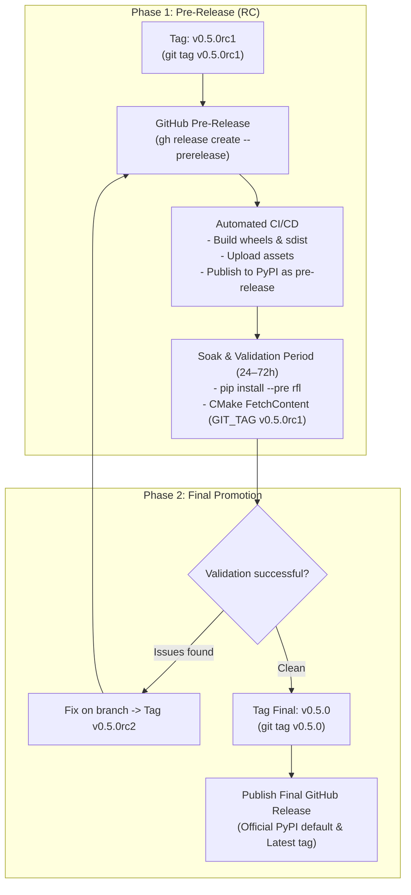

# RFL Release Process & Scientific Release Notes Guide

This document establishes the official release lifecycle, quality gates, and release notes writing standard for the `RFL` (Random Fuzzy Library) project.

---

## 1. Release Philosophy & Governance

1. **Semantic Versioning & Beta Lifecycle:** Releases follow `vMAJOR.MINOR.PATCH` (e.g. `v0.5.0`).
   - **Beta Development Phase (`v0.y.z`):** The library is currently in an active research and architectural modernisation phase. Under Semantic Versioning rules, minor version increments (e.g. `v0.5.0` → `v0.6.0` → `v0.7.0`) may introduce breaking API changes, interface refactoring, or deprecations as the scientific architecture evolves toward `v1.0.0`.
   - **Stable Production Phase (`v1.0.0+`):** After `v1.0.0`, breaking changes occur only across MAJOR version increments, with a formal deprecation period across MINOR releases.
2. **Controlled Language (ASD-STE100 & British English):**
   - Release documentation must follow controlled vocabulary defined in [docs/Glossary.md](Glossary.md).
   - Use British English spelling (*standardisation*, *optimisation*, *behaviour*, *modelling*).
3. **Impersonal Scientific Tone:**
   - Write in an objective, third-person perspective.
   - Do not use first-person pronouns (*"we"*, *"I"*, *"our"*).
   - Avoid conversational openings (e.g. *"We are pleased to announce..."*).

---

## 2. Pre-Releases & Release Candidates (RCs)

Following the convention of major scientific libraries (such as NumPy, SciPy, PyTorch, and Armadillo), significant releases use **Release Candidates** (e.g. `v0.5.0rc1`):



### 2.1 How Pre-Releases Work Across Ecosystems

1. **Naming Standard (PEP 440 & Git SemVer):**
   - Use `vX.Y.Zrc1` (e.g. `v0.5.0rc1`).
   - This tag format is natively recognized by Git, GitHub, `pip`, and `scikit-build-core`.
2. **GitHub Releases Behaviour:**
   - Pre-releases are flagged with `--prerelease` (or the "Set as a pre-release" checkbox).
   - GitHub displays a `Pre-release` badge and retains the previous release as `Latest`.
3. **PyPI & `pip` Behaviour:**
   - PyPI automatically marks `0.5.0rc1` as a pre-release.
   - A standard `pip install rfl` will **never** install a pre-release by default.
   - Downstream researchers must explicitly opt in with:
     ```bash
     pip install --pre rfl
     # or
     pip install rfl==0.5.0rc1
     ```
4. **C++ & CMake `FetchContent` Behaviour:**
   - Downstream C++ solvers test the release candidate by pinning the RC git tag:
     ```cmake
     FetchContent_Declare(
         RFL
         GIT_REPOSITORY https://github.com/pauldruce/RFL.git
         GIT_TAG        v0.5.0rc1
     )
     ```

---

## 3. The Complete Release Lifecycle

### Step 1: Pre-Release Checklist
Before tagging any release or candidate:
* Ensure all CI workflows on `main` are green.
* Verify local builds and tests pass (`ctest`, `pytest`).

### Step 2: Milestone Triage & EP Status
* Verify that all GitHub Issues and PRs for the milestone are merged and closed.
* Update the relevant Enhancement Proposal in [docs/eps/](eps/) to reflect current milestone status.

### Step 3: Tag and Publish a Release Candidate (`vX.Y.Zrc1`)
1. Create and push the release candidate tag:
   ```bash
   git checkout main
   git pull origin main
   git tag v0.5.0rc1
   git push origin v0.5.0rc1
   ```
2. Create the GitHub Pre-Release:
   ```bash
   gh release create v0.5.0rc1 --prerelease --title "v0.5.0rc1: Release Candidate 1" --notes-file release_notes.md
   ```
3. The release workflow automatically compiles wheels, packages `sdist`, attaches release assets, and uploads the pre-release to PyPI.

### Step 4: Release Candidate Testing
During the testing window (24–72 hours for `0.y.z` releases):
1. **Python Wheels:** Verify in a clean virtual environment:
   ```bash
   python -m venv test_env && source test_env/bin/activate
   pip install --pre rfl
   python -c "import rfl; print(rfl.__version__)"
   ```
2. **C++ CMake Integration:** Verify `FetchContent` in an external test project linking `RFL::core`.

### Step 5: Tag and Publish Final Release (`vX.Y.Z`)
When the release candidate is validated with zero critical defects:
1. Tag the release commit:
   ```bash
   git tag v0.5.0
   git push origin v0.5.0
   ```
2. Publish the official release:
   ```bash
   gh release create v0.5.0 --title "v0.5.0: Multi-Platform Package and Binary Distribution" --notes-file release_notes.md
   ```
3. The final packages become the default on PyPI (`pip install rfl`), assets are attached to GitHub Releases, and the milestone is closed.

---

## 4. Release Notes Template

When drafting release notes (for candidates or final versions), use the standard scientific blueprint below:

```markdown
# RFL vX.Y.Z Release Notes

> [!WARNING]
> ### Breaking Changes & Migration Guide (Beta Phase)
> RFL is in active beta development (`v0.y.z`). This release introduces the following breaking changes and migration steps:
> * **[Subsystem / API]:** [Describe the breaking change and the exact migration code / configuration].
> * **[Target / Packaging]:** [Describe target renames, e.g. Old Target `X` → New Target `Y`].

RFL version X.Y.Z introduces [one declarative sentence summarizing the release].

---

## 1. Highlights

* **[Highlight 1]:** [Brief technical description].
* **[Highlight 2]:** [Brief technical description].
* **[Highlight 3]:** [Brief technical description].

---

## 2. Packaging & Distribution

* [Detail packaging, wheel, or build system updates].
* [Detail package manager or installation improvements].

---

## 3. Python Bindings & Performance

* [Detail pybind11, NumPy zero-copy interop, or observable streaming updates].

---

## 4. Physics & Simulation Core

* [Detail DiracOperator, Action, Stepper, or Sampler enhancements].

---

## 5. Documentation & Governance

* [Detail EPs, specifications, or architectural documentation].

---

## 6. Compatibility & Requirements

* **C++ Standard:** C++17 conforming compiler (GCC ≥ 10, Clang ≥ 11, Apple Clang ≥ 13, MSVC ≥ 2019).
* **Linear Algebra:** Armadillo ≥ 11.4.0, OpenBLAS / LAPACK.
* **Stochastic Engine:** GNU Scientific Library (GSL) ≥ 2.6.
* **Python Compatibility:** Python 3.8 – 3.13, NumPy ≥ 1.22.
```

---

## 5. Testing the Release Pipeline (Dry Run)

To test wheel compilation and packaging without uploading to PyPI or modifying release assets, trigger a manual dry run:

```bash
gh workflow run release.yml -f dry_run=true -f publish_to_pypi=false
```
