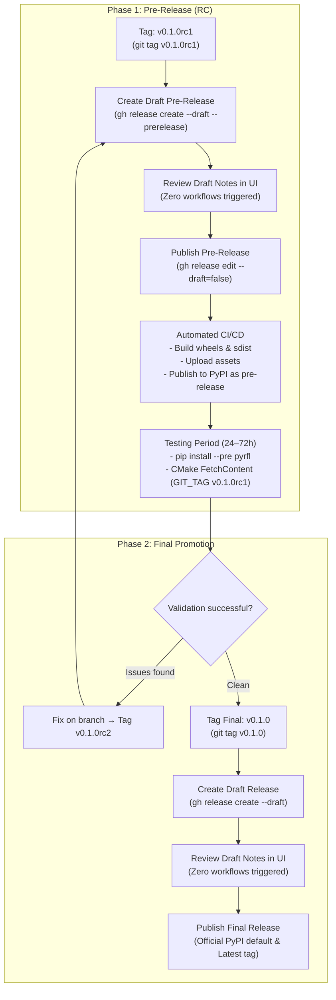
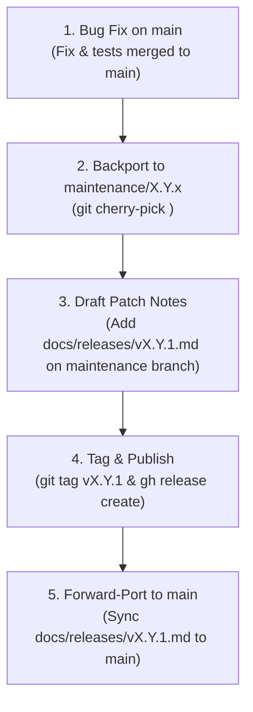

# RFL Release Process & Scientific Release Notes Guide

This document establishes the official release lifecycle, pre-release checklist, and release notes writing standard for the `RFL` (Random Fuzzy Library) project.

---

## 1. Release Philosophy & Governance

1. **Semantic Versioning & Beta Lifecycle:** Releases follow `vMAJOR.MINOR.PATCH` (e.g. `v0.1.0`).
   - **Beta Development Phase (`v0.y.z`):** The library is currently in an active research and architectural modernisation phase. Under Semantic Versioning rules, minor version increments (`v0.1.0` → `v0.2.0`) may introduce breaking API changes or refactors while the architecture evolves toward `v1.0.0`.
   - **Stable Production Phase (`v1.0.0+`):** After `v1.0.0`, breaking changes occur only across MAJOR version increments, with a formal deprecation period across MINOR releases.
2. **Controlled Language (ASD-STE100 & British English):**
   - Release documentation must follow controlled vocabulary defined in [docs/Glossary.md](Glossary.md).
   - Use British English spelling (*standardisation*, *optimisation*, *behaviour*, *modelling*).
3. **Impersonal Scientific Tone:**
   - Write in an objective, third-person perspective.
   - Do not use first-person pronouns (*"we"*, *"I"*, *"our"*).
   - Avoid conversational openings (e.g. *"We are pleased to announce..."*).
4. **Draft-First Review Gate:**
   - Always create releases and release candidates as **Drafts** first (`--draft`).
   - Review rendered release notes, breaking change warnings, and links in the GitHub UI before publishing.
   - Transitioning from draft to published initiates the automated wheel build and PyPI distribution pipeline.

---

## 2. Pre-Releases & Release Candidates (RCs)

Following the convention of major scientific libraries (such as NumPy, SciPy, PyTorch, and Armadillo), significant releases use **Release Candidates** (e.g. `v0.1.0rc1`):



### 2.1 How Pre-Releases Work Across Ecosystems

1. **Naming Standard (PEP 440 & Git SemVer):**
   - Use `vX.Y.Zrc1` (e.g. `v0.1.0rc1`).
   - This tag format is natively recognised by Git, GitHub, `pip`, and `scikit-build-core`.
2. **GitHub Releases Behaviour:**
   - Pre-releases are flagged with `--prerelease` (or the "Set as a pre-release" checkbox).
   - GitHub displays a `Pre-release` badge and retains the previous release as `Latest`.
3. **PyPI & `pip` Behaviour:**
   - PyPI automatically marks `0.1.0rc1` as a pre-release.
   - A standard `pip install pyrfl` will **never** install a pre-release by default.
   - Downstream researchers must explicitly opt in with:
     ```bash
     pip install --pre pyrfl
     # or
     pip install pyrfl==0.1.0rc1
     ```
4. **C++ & CMake `FetchContent` Behaviour:**
   - Downstream C++ solvers test the release candidate by pinning the RC git tag:
     ```cmake
     FetchContent_Declare(
         RFL
         GIT_REPOSITORY https://github.com/pauldruce/RFL.git
         GIT_TAG        v0.1.0rc1
     )
     ```

---

## 3. The Complete Release Lifecycle

### Step 1: Pre-Release Checklist
Before tagging any release or candidate:
* Ensure all CI workflows on `main` are green.
* Verify local builds and tests pass (`ctest`, `pytest`).

### Step 2: Milestone Triage & EP Status
* Verify that all GitHub Issues and PRs for the milestone are merged and closed.
* Update the relevant Enhancement Proposal in [docs/eps/](eps/) to reflect current milestone status.

### Step 3: Tag, Draft, and Publish a Release Candidate (`vX.Y.Zrc1`)
1. Create and push the release candidate tag:
   ```bash
   git checkout main
   git pull origin main
   git tag vX.Y.Zrc1
   git push origin vX.Y.Zrc1
   ```
2. Create the Draft Pre-Release using the committed release notes:
   ```bash
   gh release create vX.Y.Zrc1 --draft --prerelease --title "vX.Y.Zrc1: Release Candidate 1" --notes-file docs/releases/vX.Y.Z.md
   ```
3. Review the rendered release notes in the GitHub Web UI.
4. Publish the pre-release:
   ```bash
   gh release edit vX.Y.Zrc1 --draft=false
   ```
   The release workflow compiles wheels, packages `sdist`, attaches release assets, and uploads the pre-release to PyPI.

### Step 4: Release Candidate Testing
During the testing window (24–72 hours for `0.y.z` releases):
1. **Python Wheels:** Verify in a clean virtual environment:
   ```bash
   python -m venv test_env && source test_env/bin/activate
   pip install --pre pyrfl
   python -c "import rfl; print(rfl.__version__)"
   ```
2. **C++ CMake Integration:** Verify `FetchContent` in an external test project linking `RFL::core`.

### Step 5: Tag, Draft, and Publish Final Release (`vX.Y.Z`)
When the release candidate is validated with zero critical defects:
1. Tag the release commit:
   ```bash
   git tag vX.Y.Z
   git push origin vX.Y.Z
   ```
2. Create the Draft Release:
   ```bash
   gh release create vX.Y.Z --draft --title "vX.Y.Z: <Release Title>" --notes-file docs/releases/vX.Y.Z.md
   ```
3. Review the rendered release notes in the GitHub Web UI.
4. Publish the final release:
   ```bash
   gh release edit vX.Y.Z --draft=false
   ```
   The final packages become the default on PyPI (`pip install pyrfl`), assets are attached to GitHub Releases, and the milestone is closed.

---

## 4. In-Tree Release Notes Storage (`docs/releases/`)

Following scientific software conventions (NumPy, SciPy, Boost), all release notes are committed directly to the repository under **`docs/releases/vX.Y.Z.md`**.

### 4.1 Canonical Template
The single source of truth for authoring release notes is:
📄 **[docs/release-note-template.md](release-note-template.md)**

To author release notes for a new version:
1. Copy `docs/release-note-template.md` to `docs/releases/vX.Y.Z.md`.
2. Populate the breaking changes alert box, highlights, and component changes.
3. Commit `docs/releases/vX.Y.Z.md` on the release PR for peer review.
4. Pass `--notes-file docs/releases/vX.Y.Z.md` when creating the GitHub Release.

### 4.2 Initial Release Baseline (`v0.1.0`)
RFL versioning formally begins with **`v0.1.0`** as the initial packaged release with binary wheels and CMake target exports. Commits prior to `v0.1.0` represent unreleased prototype development recorded in git history.

### 4.3 Patch Releases & Maintenance Branch Workflow

When a bug fix patch (`vX.Y.1`) is needed while `main` develops future versions (`vX.(Y+1).0`), use the **Maintenance Branch Workflow**:



1. **Fix on `main` First:** Always land bug fixes on `main` first via PR to prevent regressions in future versions.
2. **Backport to Maintenance Branch:** Cherry-pick the bugfix commit to `maintenance/X.Y.x`.
3. **Author Patch Release Notes:** Create `docs/releases/vX.Y.1.md` on the maintenance branch detailing the repaired issues. Patch releases must never contain breaking changes.
4. **Tag & Publish:** Tag `vX.Y.1` from the maintenance branch and publish via `gh release create --notes-file docs/releases/vX.Y.1.md`.
5. **Forward-Port Notes to `main`:** Merge or copy `docs/releases/vX.Y.1.md` into `main` so `main` retains the complete release history.

---

## 5. Testing the Release Pipeline & TestPyPI Qualification

### 5.1 Automated Pull Request Testing
Any pull request that modifies `.github/workflows/release.yml`, `src/RFL/pyproject.toml`, or `src/RFL/python_bindings/**` automatically executes the complete packaging matrix. The workflow compiles all 18 binary wheels across Linux, macOS Apple Silicon, and macOS Intel, and executes the `pytest` test suite without publishing assets.

### 5.2 TestPyPI Publication & Pre-Flight Qualification
To publish packages to TestPyPI (`test.pypi.org`) for downstream verification before an official release, dispatch the release workflow with `publish_to_testpypi=true`:

```bash
gh workflow run release.yml -f publish_to_testpypi=true -f publish_to_pypi=false
```

Once publication completes, verify installation in a clean environment:

```bash
pip install --index-url https://test.pypi.org/simple/ --extra-index-url https://pypi.org/simple/ --pre pyrfl
python -c "import rfl; print('RFL loaded successfully from TestPyPI:', rfl)"
```

### 5.3 Dry Run (No Uploads)
To test wheel compilation and packaging without publishing to any index or repository, trigger a manual dry run:

```bash
gh workflow run release.yml -f dry_run=true -f publish_to_pypi=false -f publish_to_testpypi=false
```
