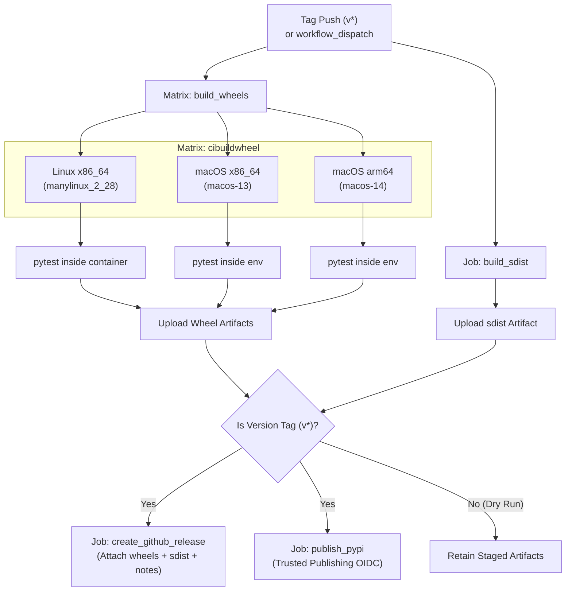

# EP-2: Multi-Platform Package and Binary Distribution

* **Title:** Multi-Platform Package and Binary Distribution
* **Author:** Paul Druce
* **Status:** Accepted (Phase 1 Implemented)
* **Target Version:** RFL v0.5.0 – v0.7.0
* **Date:** 2026-08-30

---

## 1. Motivation, Goals & Non-Goals

### 1.1 Problem Statement & Research Context
`RFL` enables researchers to simulate finite noncommutative geometries and random fuzzy spaces using Markov Chain Monte Carlo methods.
Researchers study spectral triples $(A, \mathcal{H}, D)$ and the Barrett-Glaser action across diverse computing environments:
1. Python data science workflows (Jupyter notebooks, NumPy, SciPy, Matplotlib).
2. High-performance C++ batch simulations.
3. Automated cluster runs on Linux and macOS workstations.

Previously, consuming RFL required compiling C++ source code locally.
Consumers had to install CMake, C++17 compilers, Armadillo, LAPACK, BLAS, and GSL manually.
This requirement created friction for theoretical physicists and data scientists who require a fast `pip install rfl` workflow.
In addition, external C++ simulation programs had no standard CMake target mechanism to link `libnew_RFL`.
The codebase also suffered from historical directory naming debt (`new_RFL` and `old_RFL`), which created confusing target names for external consumers.

### 1.2 Goals
* **Clean Target & Directory Standardization:** Promote `new_RFL` to `core/` with target `rfl` (aliases: `RFL::core`, `RFL::rfl`), and archive `old_RFL` to `legacy/` (`rfl_legacy`).
* **Zero-Compile Python Installation:** Publish precompiled binary wheels to PyPI and GitHub Releases for Linux and macOS (`x86_64`, `arm64`) across Python 3.8 to 3.13.
* **Self-Contained Shared Binaries:** Vendor required dynamic libraries (`libarmadillo`, `libgsl`, `libopenblas`) inside wheels using `auditwheel` and `delocate`.
* **Immediate C++ In-Tree Integration:** Provide namespaced CMake alias targets (`RFL::core`, `RFL::rfl`) for CMake `FetchContent` workflows.
* **Precompiled C++ Binary Archives:** Generate installable tarballs (`rfl-vX.Y.Z-<os>-<arch>.tar.gz`) containing headers, compiled libraries, and `RFLConfig.cmake`.
* **Multi-Phase Ecosystem Roadmap:** Structure distribution across discrete phases spanning PyPI, CMake, GitHub Releases, Homebrew, and Conda-Forge.

### 1.3 Non-Goals
* Supporting legacy Python versions (< 3.8) or non-standard interpreters (PyPy).
* Supporting 32-bit operating systems or musl libc distributions.
* Distributing closed-source binary blobs without public build recipes.

---

## 2. Research Workflows & Scientific Requirements

### 2.1 Core Research Scenarios
1. **Scenario 1 (Interactive Spectral Analysis in Python):** A physicist installs RFL via `pip install rfl` in an isolated virtual environment and computes Dirac eigenvalue spectra in Jupyter.
2. **Scenario 2 (Custom C++ Simulation Pipeline):** A researcher includes RFL into an external C++ MCMC solver using `FetchContent_Declare(RFL ...)` and links `RFL::core` without manually configuring header search paths.
3. **Scenario 3 (Unified Scientific Environment):** A research lab installs `librfl` and `rfl` via Conda into reproducible simulation environments.

### 2.2 Functional Requirements & Invariants

| Requirement ID | Requirement Summary | Physical & Technical Invariant |
| :--- | :--- | :--- |
| **REQ-PKG-01** | **Directory & Target Standardization** | Restructure `new_RFL/` $\to$ `core/` (target `rfl`, alias `RFL::core`) and `old_RFL/` $\to$ `legacy/` (target `rfl_legacy`). |
| **REQ-PKG-02** | **Multi-Platform Binary Wheels** | Build standalone wheels for Linux (`manylinux_2_28`) and macOS (`x86_64`, `arm64`) covering Python 3.8–3.13. |
| **REQ-PKG-03** | **Vendored Shared Libraries** | Bundle dynamic dependencies (`openblas`, `gsl`, `armadillo`) so wheels execute on clean systems. |
| **REQ-PKG-04** | **Pre-Publication Test Gate** | Execute Python test suite (`pytest`) inside clean wheel environments before publication. |
| **REQ-PKG-05** | **Secure PyPI Publishing** | Use OpenID Connect (OIDC) Trusted Publishing to prevent static secret exposure. |
| **REQ-PKG-06** | **CMake FetchContent Support** | Export namespaced alias `RFL::core` and `RFL::rfl` in top-level CMake configuration. |
| **REQ-PKG-07** | **Standard CMake Installation** | Define CMake `install()` targets for public headers, compiled libraries, and CMake config packages. |
| **REQ-PKG-08** | **CPack Binary Packaging** | Generate `.tar.gz` release archives containing headers, static libraries, and package configuration files. |
| **REQ-PKG-09** | **Ecosystem Package Distribution** | Provide recipes for Homebrew Tap, Conda-Forge, and evaluate C++ registries (Conan, vcpkg). |

---

## 3. Architecture Decision Records (ADRs) & Trade-offs

### 3.1 ADR-1: Directory Layout & Target Names

| Criteria | Option A: Standardized Layout (`core/` & `legacy/`) (Selected) | Option B: Retain `new_RFL` / `old_RFL` |
| :--- | :--- | :--- |
| **Public API Clarity** | High (`RFL::core`, `RFL::rfl`) | Poor (`RFL::new_RFL` conveys prototype state) |
| **Historical Separation** | Clear (`legacy/` explicitly marked) | Ambiguous |
| **Packaging Cleanliness** | Standard CMake conventions | Non-standard paths |
| **Decision** | **Selected (Option A)** | Rejected |

*Rationale:* Promoting modern code to `src/RFL/core` and archiving historical code to `src/RFL/legacy` establishes an intuitive and lasting naming standard before the `v0.5.0` release.

---

### 3.2 ADR-2: Python Wheel Build Automation Framework

| Criteria | Option A: `pypa/cibuildwheel` (Selected) | Option B: Custom Matrix Shell Scripts | Option C: Source Distribution (`sdist`) Only |
| :--- | :--- | :--- | :--- |
| **Standardisation** | High (PyPA standard for scientific Python) | Low (Bespoke maintenance) | High (Standard `build --sdist`) |
| **Library Vendoring** | Automated (`auditwheel`, `delocate`) | Manual configuration | None (Fails on systems without C++ stack) |
| **Isolated Testing** | Built-in per Python version | Custom virtual environments | Relies on consumer environment |
| **User Experience** | Instant `pip install rfl` | Instant `pip install rfl` | High friction for non-C++ users |
| **Decision** | **Selected (Option A)** | Rejected | Rejected |

*Rationale:* `cibuildwheel` encapsulates `manylinux` container management, executes tests inside clean wheel environments, and automates dynamic library vendoring.

---

### 3.3 ADR-3: C++ Dependency Management & Library Vendoring

| Criteria | Option 1: Package Manager Provisioning + Vendoring (Selected) | Option 2: Monolithic Static Build from Source |
| :--- | :--- | :--- |
| **CI Build Time** | Fast (1–3 minutes using `dnf`/`brew`) | Slow (15–30 minutes compiling OpenBLAS/GSL) |
| **Binary Portability** | High (`auditwheel` and `delocate` bundle shared libraries) | High (Static linking) |
| **Maintenance** | Low (System package updates) | High (Custom CMake build recipes) |
| **Decision** | **Selected (Option 1)** | Rejected |

*Rationale:* Installing `openblas`, `lapack`, `gsl`, and `armadillo` via `dnf` on Linux and `brew` on macOS provides fast, reliable CI builds.
`auditwheel` and `delocate` automatically discover and vendor dynamic dependencies into the wheel.

---

### 3.4 ADR-4: PyPI Authentication & Supply Chain Security

| Criteria | Option A: PyPI Trusted Publishing / OIDC (Selected) | Option B: Repository Secret API Token |
| :--- | :--- | :--- |
| **Security Posture** | High (Short-lived cryptographic tokens) | Moderate (Long-lived secret stored in GitHub) |
| **Secret Management** | Zero secrets required in repository settings | Requires updating static tokens |
| **Industry Standard** | PyPA recommended standard | Legacy method |
| **Decision** | **Selected (Option A)** | Rejected |

*Rationale:* Trusted Publishing authenticates directly between GitHub Actions and PyPI using OpenID Connect, eliminating credential leakage risks.

---

### 3.5 ADR-5: C++ Consumption & Distribution Strategy

| Criteria | Option A: CMake `FetchContent` (Phase 1) | Option B: CPack Binary Tarballs (Phase 2) | Option C: Package Registries (Phase 3) |
| :--- | :--- | :--- | :--- |
| **Target Audience** | Active C++ researchers building from source | C++ researchers wanting prebuilt libraries | macOS and Conda data scientists |
| **ABI Compatibility** | Perfect (Builds with consumer compiler) | Restricted to compatible toolchains | Managed by package manager |
| **Infrastructure** | Zero extra infrastructure | GitHub Releases asset attachment | Feedstock / Tap repositories |
| **Decision** | **Selected (Phase 1)** | **Selected (Phase 2)** | **Selected (Phase 3)** |

*Rationale:* Combining all three distribution channels across distinct phases provides immediate integration while establishing a robust long-term packaging roadmap.

---

### 3.6 ADR-6: Package Manager Ecosystem Trade-offs

| Package Manager | Target Ecosystem | Pros | Cons & Considerations |
| :--- | :--- | :--- | :--- |
| **Homebrew** | macOS Researchers | Seamless `brew install rfl` resolving dependencies. | macOS focus; Linuxbrew adoption is low. |
| **Conda-Forge** | Scientific Python & C++ | Packages both `librfl` and `rfl` with pinned BLAS/GSL. | Requires maintaining a separate feedstock repo. |
| **vcpkg / Conan** | Enterprise & C++ Developers | Integrated C++ dependency graph management. | Higher overhead; less common in mathematical physics. |

---

## 4. Target Architecture & Workflow Design

### 4.1 The 3-Phase Roadmap

```mermaid
flowchart LR
    subgraph "Phase 1: PyPI & GitHub Releases (v0.5.0)"
        P1A["Restructure core/ & legacy/"]
        P1B["cibuildwheel (Linux/macOS)"]
        P1C["PyPI OIDC Publishing"]
        P1D["CMake FetchContent (RFL::core)"]
    end

    subgraph "Phase 2: CMake Targets & CPack (v0.7.0)"
        P2A["CMake install() Rules"]
        P2B["RFLConfig.cmake Export"]
        P2C["CPack Binary Tarballs"]
    end

    subgraph "Phase 3: Package Managers (Future)"
        P3A["Homebrew Tap (macOS)"]
        P3B["Conda-Forge Feedstock"]
        P3C["Conan / vcpkg Evaluation"]
    end

    Phase 1 --> Phase 2 --> Phase 3
```

### 4.2 Release Pipeline Workflow (`.github/workflows/release.yml`)



---

## 5. Verification Matrix & Quality Gates

| Verification Gate | Command / Test Description | Target Invariant |
| :--- | :--- | :--- |
| **Local Unit Tests** | `pytest src/RFL/python_bindings/tests/unit` | Verifies Python API and exception propagation. |
| **Local Integration Tests** | `pytest src/RFL/python_bindings/tests/integration` | Verifies NumPy zero-copy buffer safety and memory management. |
| **Please Build Verification** | `./pleasew test //src/RFL/python_bindings/tests:all` | Validates in-tree Please hermetic build with new `core/` path. |
| **cibuildwheel Test Phase** | `pytest {project}/src/RFL/python_bindings/tests` | Verifies installed wheel inside clean containers. |
| **Auditwheel Verification** | `auditwheel show <wheel_file>` | Verifies all dynamic libraries are vendored into `.libs`. |
| **Delocate Verification** | `delocate-listdeps <wheel_file>` | Verifies macOS dylibs are vendored and paths patched. |

---

## 6. Phased Delivery Plan

### Phase 1: Directory Restructuring, PyPI Wheels, GitHub Releases & CMake FetchContent
* **Target Milestone:** `v0.5.0`
* **GitHub Issue:** [Issue #18](https://github.com/pauldruce/RFL/issues/18)
* **Tasks:**
  1. Rename `src/RFL/new_RFL` $\to$ `src/RFL/core` and `src/RFL/old_RFL` $\to$ `src/RFL/legacy`.
  2. Update CMake target names (`rfl`, `RFL::core`, `RFL::rfl`, `rfl_legacy`) across CMakeLists.txt.
  3. Update Please build targets (`src/RFL/core/BUILD`, `src/RFL/legacy/BUILD`, `src/RFL/BUILD`).
  4. Configure `[tool.cibuildwheel]` in `src/RFL/pyproject.toml`.
  5. Create `.github/workflows/release.yml` with wheel matrix, sdist build, GitHub Release creation, and PyPI OIDC publishing.
  6. Update `README.md` and `docs/Consumption_Guide.md` with `pip` and `FetchContent` instructions.

### Phase 2: CMake Installation Targets & CPack Binary Packaging
* **Target Milestone:** `v0.7.0`
* **GitHub Issue:** [Issue #3](https://github.com/pauldruce/RFL/issues/3)
* **Tasks:**
  1. Define CMake `install(TARGETS rfl EXPORT RFLTargets ...)` and header install rules.
  2. Generate and install `RFLConfig.cmake` and `RFLConfigVersion.cmake`.
  3. Configure CPack to package `.tar.gz` and `.zip` archives.
  4. Add CPack artifact generation step to `.github/workflows/release.yml`.

### Phase 3: Community Package Managers
* **Target Milestone:** Future / Backlog
* **GitHub Issue:** [Issue #29](https://github.com/pauldruce/RFL/issues/29)
* **Tasks:**
  1. Create Homebrew formula in `pauldruce/homebrew-rfl`.
  2. Create Conda-Forge feedstock for `librfl` and `rfl`.
  3. Complete research trade study on Conan and vcpkg registries.
