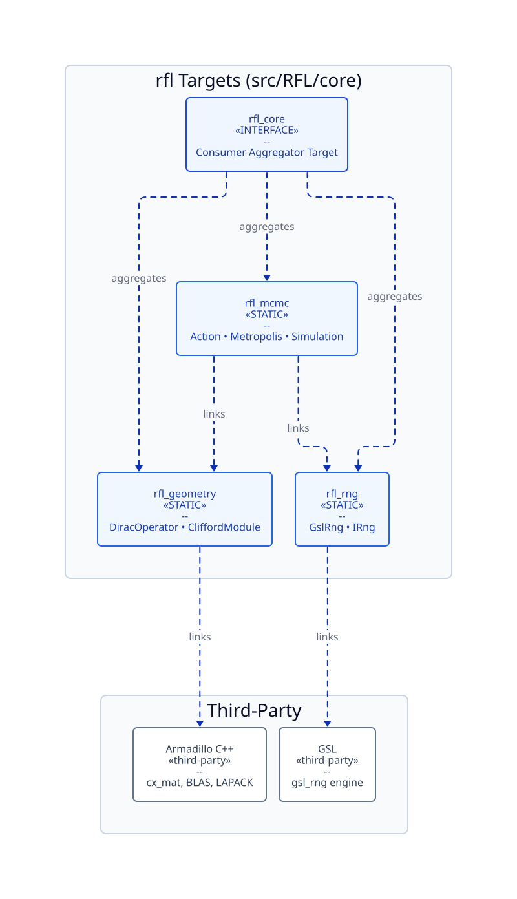

# EP-3: Unified Modern Build, Tooling & CI/CD Architecture

* **Title:** Unified Modern Build, Tooling & CI/CD Architecture
* **Author:** Paul Druce
* **Status:** Accepted (In Progress)
* **Target Versions:** RFL v0.2.0
* **Date:** 2026-09-04

---

## 1. Multi-Phase Implementation Tracker

This proposal establishes the foundational build, quality, and CI/CD architecture for RFL `v0.2.0`.
The table below tracks the status of each implementation phase:

| Phase | Scope & Deliverables | Target Version | PR / Issue | Status |
| :--- | :--- | :--- | :--- | :--- |
| **Phase 1** | Tier 1 Fast PR Gate (Path filtering, dual-platform smoke tests, status gatekeeper) | `v0.2.0` | [#19](https://github.com/pauldruce/RFL/issues/19), [#23](https://github.com/pauldruce/RFL/issues/23), [PR #42](https://github.com/pauldruce/RFL/pull/42) | ✅ Completed |
| **Phase 2** | Build & Tooling Consolidation (Single-source build, reproducible developer environment, automated code quality) | `v0.2.0` | [#23](https://github.com/pauldruce/RFL/issues/23) | 🔄 In Progress |
| **Phase 3** | Dependency Decoupling & Automated External Package Acquisition | `v0.2.0` | [#22](https://github.com/pauldruce/RFL/issues/22) | 💡 Planned |
| **Phase 4** | Native Windows CI Runner, MSVC Verification & Binary Wheel Automation | `v0.2.0` | [#21](https://github.com/pauldruce/RFL/issues/21) | 💡 Planned |

---

## 2. Motivation, Goals & Non-Goals

### 2.1 Problem Statement & Research Context
`RFL` provides Markov Chain Monte Carlo (MCMC) simulations of finite noncommutative geometries.
As the project evolved towards `v0.2.0`, the infrastructure accumulated technical debt across five core areas:

1. **Uncoordinated CI Workflows & Compute Bottlenecks:**
   * Pull requests triggered an un-cached 15-job matrix across operating systems and compiler versions.
   * Contributors waited 15 to 25 minutes for pull request feedback.
   * Documentation updates triggered complete C++ recompilation matrices, consuming thousands of runner minutes pointlessly.

2. **Build Specification Duality & Maintenance Overhead:**
   * The repository maintained two distinct build systems simultaneously.
   * Every C++ source file, header, and test suite required duplicate declarations across divergent configuration files.
   * Divergent build configurations created operational friction across platforms and blocked native Windows support.
   * Packaging Python wheels required invoking nested build scripts that obscured error reporting.

3. **Fragile Formatting & Code Quality Scripts:**
   * Repository formatting and linting relied on ad-hoc shell scripts with hardcoded file-finding logic.
   * These scripts broke whenever developers added new directories or build folders.
   * Toolchain version drift between local developer machines and CI caused unexpected linting failures.

4. **Monolithic C++ Compilation & Slow Feedback Loops:**
   * Modifying a single leaf C++ file triggered widespread recompilation because targets were tightly coupled.
   * Heavy mathematical and scientific headers were parsed repeatedly on every build.

5. **Inconsistent Developer Tooling Across Operating Systems:**
   * Developers faced divergent manual setups, environment configurations, and command invocations across Linux, macOS, and Windows.
   * Lack of declarative local tooling made onboarding slow and error-prone.

A top-down architectural consolidation is required.
The new architecture must address these bottlenecks by defining clear operational requirements, evaluating competing solutions, and selecting robust technical standards.

### 2.2 Goals
* **Sub-2-Minute Dual-Platform PR Feedback:** Validate pull requests on Ubuntu and macOS runners in under two minutes.
* **Zero-Compute Documentation Changes:** Ensure documentation-only pull requests consume zero compilation runner minutes.
* **Exhaustive Mainline Compatibility Verification:** Execute the full multi-version matrix when code merges into the default branch.
* **Single Source of Truth for Builds:** Consolidate all build, test, and packaging definitions into a single declarative build specification across all platforms.
* **Unified, Cross-Platform Developer Interface:** Provide identical, declarative commands for common tasks (build, test, lint, format) across Linux, macOS, and Windows.
* **Zero-Maintenance Code Quality Enforcement:** Automate linting, formatting, and spelling checks on tracked files with pinned tool versions, eliminating brittle scripts.
* **Sub-2-Second Incremental Recompilation:** Decouple library components and optimise compilation units so leaf modifications build and test in under two seconds.
* **Transparent Object Caching:** Support transparent compiler object caching across local development and CI runners.
* **Strict Forward Windows Compatibility:** Ensure all build specifications, compiler flags, and project tooling support native Windows without requiring emulation layers or containers.
* **Direct, Standardised Python Packaging:** Build native Python extension wheels directly through standard packaging interfaces without redundant wrapper layers.

### 2.3 Non-Goals
* Managing self-hosted GitHub Actions runners.
* Implementing distributed remote execution across private compute clusters.
* Supporting legacy compilers lacking C++17 conformance.
* Rewriting core numerical algorithms in alternative programming languages.

---

## 3. Research Workflows & Scientific Requirements

### 3.1 Core Research Scenarios
1. **Scenario 1 (Documentation and Theoretical Research):** A researcher updates scientific derivations in the documentation. The CI pipeline identifies documentation-only changes and completes in seconds without launching compilers.
2. **Scenario 2 (Algorithm Iteration and Rapid Prototyping):** A developer refactors Dirac operator routines in core C++. Running the project test task recompiles only changed units and executes unit tests in under two seconds.
3. **Scenario 3 (Zero-Friction Code Hygiene):** A developer modifies code across multiple languages. Running the project format task auto-formats all modified files according to project standards.
4. **Scenario 4 (Exhaustive Mainline Verification):** When a pull request merges into the default branch, the CI pipeline executes all matrix combinations to guarantee broad compatibility.
5. **Scenario 5 (Multi-Platform Onboarding):** A researcher clones the repository on Linux, macOS, or Windows. Running a single initialisation command configures identical developer toolchains with zero manual configuration.

### 3.2 Functional Requirements & Invariants

| Requirement ID | Requirement Summary | Operational & Invariant Definition |
| :--- | :--- | :--- |
| **REQ-ARC-001** | **Fast Dual-Platform PR Gate** | Tier 1 PR checks must validate Ubuntu and macOS runners in under 120 seconds using pre-installed system packages. |
| **REQ-ARC-002** | **Zero-Compute Documentation PRs** | Commits touching only documentation, markdown, or configuration files must trigger zero compilation jobs. |
| **REQ-ARC-003** | **Branch Protection Integrity** | Path-filtered workflows must report passing status checks to GitHub to prevent pull request deadlocks. |
| **REQ-ARC-004** | **Unified Single-Source Build Specification** | All C++ libraries, test targets, and bindings must be declared in a single build specification across all supported operating systems. |
| **REQ-ARC-005** | **Declarative Multi-Platform Developer Tasks** | Developer workflows (build, test, lint, format) must be invoked through identical declarative commands across Linux, macOS, and Windows. |
| **REQ-ARC-006** | **Automated Zero-Maintenance Code Hygiene** | Code formatting, linting, and spell-checking must run automatically on git-staged or tracked files with pinned tool versions. |
| **REQ-ARC-007** | **Fine-Grained Modular Target Decomposition** | Core C++ libraries must be decomposed into independent component targets to ensure modifying a leaf file recompiles only dependent units. |
| **REQ-ARC-008** | **Compiler Object Caching** | The build system must support transparent compiler object caching across local builds and CI runners, achieving cache hits above 70%. |
| **REQ-ARC-009** | **Strict Forward Windows Compatibility** | All build definitions, compiler configurations, and repository conventions must support native Windows execution without emulation layers. |
| **REQ-ARC-010** | **Direct Standardised Python Packaging** | The Python packaging mechanism must directly compile and package native extensions using standard PEP 517 workflows without wrapper scripts. |

---

## 4. Architecture Decision Records (ADRs) & Trade-offs

### 4.1 ADR-1: CI Execution Topology (Tiered CI with Dual-Platform PR Smoke Test)

| Criteria | Option A: Monolithic 15-Job Matrix on PR | Option B: Fast 2-Platform PR Gate + Full Matrix on Main (Selected) | Option C: Linux-Only PR Gate |
| :--- | :--- | :--- | :--- |
| **PR Turnaround Time** | ❌ 15–25 minutes | ✅ **< 2 minutes** | ✅ < 1.5 minutes |
| **Runner Minute Cost** | ❌ 60–90 minutes per PR | ✅ **3–5 minutes per PR** | ✅ 1–2 minutes per PR |
| **Early macOS/Linux Detection** | ✅ High | ✅ **High (Catches 99% of POSIX/Clang divergence)** | ❌ None (macOS issues delayed) |
| **Exhaustive Verification Gate** | On every PR commit | ✅ **On every commit to `main`** | On every commit to `main` |
| **Decision** | Rejected | **Selected (Option B)** | Rejected |

*Rationale:* Personal repositories cannot use native GitHub Merge Queues. Option B provides the optimal balance. Pull requests test Ubuntu and macOS with fast system packages. This catches compiler issues within 2 minutes. The full 15-job matrix runs automatically upon push to `main` to verify complete matrix compatibility.

---

### 4.2 ADR-2: Path Filtering Strategy

| Criteria | Option A: Top-Level `paths-ignore` | Option B: Job-Level Path Evaluator (Selected) | Option C: Commit Message Tokens |
| :--- | :--- | :--- | :--- |
| **Branch Protection Compatibility** | ❌ Fails (Skipped workflows leave checks pending) | ✅ **Guaranteed (Workflow executes and reports green check)** | ⚠️ Unreliable (Requires manual developer action) |
| **Granularity** | ⚠️ Binary (Entire workflow skips) | ✅ **Multi-category (Docs, Python, Core C++)** | ❌ Single string matching |
| **Reliability** | ✅ High | ✅ **High** | ❌ Poor (Developers forget tokens) |
| **Decision** | Rejected | **Selected (Option B)** | Rejected |

*Rationale:* Top-level `paths-ignore` causes pull requests to hang if repository branch protection enforces required status checks. Using a job-level path filter (`dorny/paths-filter`) allows the workflow to execute, dynamically skip compilation jobs, and immediately report a successful status check.

---

### 4.3 ADR-3: CI Dependency Acquisition Strategy

| Criteria | Option A: SourceForge Tarball Compilation | Option B: System Package Managers (`apt`/`brew`) | Option C: CMake `FetchContent` Fallback |
| :--- | :--- | :--- | :--- |
| **Setup Duration** | ❌ 3–5 minutes per runner | ✅ **5–10 seconds per runner** | ⚠️ 1–2 minutes (cached) |
| **Mirror Availability** | ❌ Unreliable (SourceForge timeouts) | ✅ **High (Local GitHub runner mirrors)** | ✅ High (Git mirror) |
| **Cleanliness** | ❌ Pollutes global directories | ✅ Cleanly tracked by OS | ✅ Contained in build directory |
| **Multi-Version Flexibility** | ✅ High (Compiles any tag) | ⚠️ Limited to distro package | ✅ **High (Pulls any Git commit/tag)** |
| **Decision** | Rejected | **Selected for Tier 1 Gate** | **Selected for Tier 2 & FetchContent** |

*Rationale:* Recompiling Armadillo from SourceForge on every job wastes thousands of compute minutes annually. Tier 1 gates use system packages (`libarmadillo-dev`, `brew install armadillo`) for instant setup. Tier 2 compatibility matrices use CMake `FetchContent` and `ccache` to test specific library versions cleanly.

---

### 4.4 ADR-4: Build System Consolidation & Single Source of Truth

| Criteria | Option A: Please Build Everywhere | Option B: Dual Build (`CMake` + `Please`) | Option C: Modern CMake + Ninja (Selected) |
| :--- | :--- | :--- | :--- |
| **Single Source of Truth** | ❌ No (CMake required for external users) | ❌ No (Double maintenance of every file) | ✅ **Yes (`CMakeLists.txt` only)** |
| **Platform Symmetry** | ⚠️ Asymmetric (WSL required for Windows) | ⚠️ Divergent (Ubuntu Please, macOS CMake) | ✅ **100% Identical (Linux, macOS, Windows)** |
| **Windows MSVC Support** | ❌ High friction / Unsupported | ❌ High friction | ✅ **Native & Proven** |
| **Python Packaging** | ⚠️ Nested wrapper around CMake | ⚠️ Nested wrapper around CMake | ✅ **Direct (`scikit-build-core`)** |
| **Rebuild Latency** | ✅ < 1 second (`.plz-cache`) | ⚠️ Variable | ✅ **< 2 seconds (`ccache` + Ninja)** |
| **Decision** | Rejected | Rejected | **Selected (Option C)** |

*Rationale:* Please build was introduced as an experiment in build graph pruning. However, maintaining two parallel build systems adds heavy maintenance overhead. Furthermore, Please obstructs native Windows MSVC support and wraps `scikit-build-core` in an unnecessary layer. Modern CMake (3.24+) with Ninja, Precompiled Headers, and `ccache` delivers sub-2-second rebuilds without dual-maintenance costs.

---

### 4.5 ADR-5: Developer Environment & Task Orchestration

| Criteria | Option A: Ad-Hoc Shell Scripts & Makefiles | Option B: Custom Build Rules (`BUILD.plz`) | Option C: Mise + CMakePresets (Selected) |
| :--- | :--- | :--- | :--- |
| **Tool Version Management** | ❌ Manual (Distro dependent) | ⚠️ Go wrapper only | ✅ **Unified (Pins CMake, Ninja, Python)** |
| **IDE Integration** | ❌ None | ❌ Custom plugin required | ✅ **Native (`CMakePresets.json`)** |
| **Cross-Platform CLI** | ⚠️ Shell scripts break on Windows | ⚠️ Limited on Windows | ✅ **Identical commands across all OSs** |
| **Maintenance Cost** | ❌ High (Scripts rot over time) | ❌ High (Dual build rules) | ✅ **Low (Single declarative `mise.toml`)** |
| **Decision** | Rejected | Rejected | **Selected (Option C)** |

*Rationale:* [Mise](https://mise.jdx.dev/) provides a lightweight, polyglot developer interface. It automatically provisions exact versions of CMake, Ninja, ccache, and Python without root privileges. Combined with `CMakePresets.json`, developers and IDEs share identical build configurations across macOS, Linux, and Windows.

---

### 4.6 ADR-6: Automated Code Quality Architecture

| Criteria | Option A: Custom Shell Scripts (Find & Grep) | Option B: Language-Specific CLI Tools | Option C: Pre-Commit Framework (Selected) |
| :--- | :--- | :--- | :--- |
| **File Discovery** | ❌ Fragile (Manual directory exclusions) | ⚠️ Manual path passing | ✅ **Automatic (Runs on git-tracked files)** |
| **Version Consistency** | ❌ Local versions drift from CI | ❌ Local versions drift from CI | ✅ **Guaranteed (Pinned in config)** |
| **Multi-Language Support** | ❌ Complex multi-command scripts | ❌ Multiple disconnected tools | ✅ **Unified (C++, Python, Markdown)** |
| **Automatic Remediation** | ❌ Most scripts report errors only | ⚠️ Tool-dependent flags | ✅ **Auto-fixes formatting in place** |
| **Decision** | Rejected | Rejected | **Selected (Option C)** |

*Rationale:* Hardcoded shell scripts break whenever new project directories are added. The `pre-commit` framework locks tool versions (`clang-format`, `ruff`, `cspell`) and runs automatically on git-tracked files. It ignores untracked build directories natively, eliminating script maintenance.

---

### 4.7 ADR-7: Python Packaging Backend Architecture

| Criteria | Option A: Please Build Wrapper | Option B: Legacy `setuptools` with `setup.py` | Option C: `scikit-build-core` (Selected) |
| :--- | :--- | :--- | :--- |
| **Standards Compliance** | ⚠️ Custom non-standard build rule | ⚠️ Deprecated legacy configuration | ✅ **Strict PEP 517 / PEP 621 Standard** |
| **CMake Integration** | ⚠️ Wrapped inside external process | ❌ Fragile custom C++ extensions | ✅ **First-class native CMake bridge** |
| **Build Configuration** | ⚠️ Duplicated in build rules | ⚠️ Split across multiple files | ✅ **Declarative `pyproject.toml`** |
| **Cross-Platform Wheels** | ❌ Obstructs Windows `cibuildwheel` | ⚠️ Difficult MSVC setup | ✅ **Seamless across Linux, macOS, Windows** |
| **Decision** | Rejected | Rejected | **Selected (Option C)** |

*Rationale:* Packaging native C++ extensions requires a modern, standards-compliant build backend. `scikit-build-core` communicates directly with CMake without wrapping layers. It reads configuration cleanly from `pyproject.toml` and works out of the box with `cibuildwheel` across Linux, macOS, and Windows.

---

### 4.8 ADR-8: CI Status Check Enforcement & Branch Protection (`ci-gate`)

| Criteria | Option A: Aggregate Gatekeeper (`ci-gate`) (Selected) | Option B: Require Individual Matrix Jobs |
| :--- | :--- | :--- |
| **Doc-Only Safety** | ✅ **100% Safe (Evaluates skipped jobs as successful)** | ❌ **Deadlocks on doc-only PRs** |
| **Settings Maintenance** | ✅ **Zero maintenance (Only one check name required)** | ❌ High (Breaks whenever matrix changes) |
| **PR Clarity** | ✅ Single decisive status badge | ❌ Many confusing status items |
| **Decision** | **Selected (Option A)** | Rejected |

*Rationale:* Branch protection on `main` requires a single aggregate status check: `ci-gate`. This job evaluates the results of all upstream PR gate jobs. If jobs are safely skipped due to path filtering, `ci-gate` reports success. If any executed job fails, `ci-gate` fails and blocks merging.

---

## 5. Target Architecture & Component Contracts

### 5.1 System Architecture & Project Layout

```
RFL/
├── .github/
│   └── workflows/
│       ├── ci.yml                 # Tier 1: Fast PR smoke gate (Ubuntu, macOS via CMake + ccache)
│       ├── compatability_tests.yml# Tier 2: Exhaustive compatibility matrix on push to main
│       ├── linter.yml             # Code quality gate using pre-commit
│       └── release.yml            # Automated wheel generation and PyPI distribution
├── cmake/                         # Modular CMake modules (Armadillo, FetchContent, Ccache, PCH)
├── src/RFL/
│   ├── CMakeLists.txt             # The SINGLE source of truth for C++ & bindings
│   ├── pyproject.toml             # scikit-build-core packaging configuration
│   ├── core/                      # Modular C++ sub-targets (RFL::geometry, RFL::mcmc, RFL::rng)
│   ├── python_bindings/           # pybind11 module
│   └── examples/
├── docs/                          # Architecture & Enhancement Proposals (EPs)
├── mise.toml                      # Unified local task runner & tool manager
├── CMakePresets.json              # Standardised configure/build presets for IDEs & CI
├── .clang-format                  # C++ code style configuration
├── .editorconfig                  # Universal whitespace & encoding rules
├── .cspell.json                   # British English spelling dictionary
└── .pre-commit-config.yaml        # Pinned multi-language linting hooks
```

---

### 5.2 Modular CMake Target Architecture & Precompiled Headers

To prevent full rebuilds when modifying leaf source files, `src/RFL/core/CMakeLists.txt` decomposes `rfl_core` into modular component targets:



*Figure 5.1: Modular CMake component target architecture. Source scripts co-located at [`docs/images/cmake_targets.puml`](../images/cmake_targets.puml) and [`docs/images/cmake_targets.d2`](../images/cmake_targets.d2).*

| Target | Target Type | Contents | Dependencies |
| :--- | :--- | :--- | :--- |
| **`rfl_rng`** | `STATIC` | `GslRng`, `IRng` | GSL |
| **`rfl_geometry`** | `STATIC` | `Clifford`, `DiracOperator` | Armadillo |
| **`rfl_mcmc`** | `STATIC` | `Action`, `Hamiltonian`, `Metropolis`, `Simulation` | `rfl_geometry`, `rfl_rng` |
| **`rfl_core`** | `INTERFACE` | Aggregate consumer target | `rfl_geometry`, `rfl_rng`, `rfl_mcmc` |

1. **Target Isolation:** Editing a file in `rfl_mcmc` recompiles only that specific translation unit. Unrelated component libraries remain untouched.
2. **Precompiled Headers (PCH):** Precompiling heavy scientific headers (`<armadillo>`, `<gsl/...>`, `<vector>`, `<complex>`) reduces compilation times by up to 70%:
   ```cmake
   target_precompile_headers(rfl_core
       INTERFACE
           <armadillo>
           <gsl/gsl_rng.h>
           <vector>
           <complex>
           <memory>
   )
   ```
3. **CTest Labels for Targeted Execution:** Tests are tagged by component for selective execution:
   ```cmake
   set_tests_properties(GeometryTests PROPERTIES LABELS "Geometry")
   set_tests_properties(McmcTests PROPERTIES LABELS "MCMC")
   ```

---

### 5.3 Unified Developer Interface with Mise (`mise.toml`)

Mise manages development tools and defines reproducible project tasks:

```toml
[tools]
cmake = "3.31"
ninja = "1.12"
ccache = "4.10"
python = "3.12"
pre-commit = "3.8"

[env]
CMAKE_GENERATOR = "Ninja"
CMAKE_CXX_COMPILER_LAUNCHER = "ccache"

[tasks.build]
description = "Configure and compile RFL C++ targets"
run = "cmake -B build -S src/RFL -DCMAKE_BUILD_TYPE=Release && cmake --build build"

[tasks.test]
description = "Execute all CTest unit tests"
depends = ["build"]
run = "ctest --test-dir build --output-on-failure"

[tasks.lint]
description = "Verify formatting across the repository"
run = "pre-commit run --all-files"

[tasks.format]
description = "Automatically format all code across the repository"
run = "pre-commit run --all-files"

[tasks.dev]
description = "Install editable Python bindings"
run = "pip install -e src/RFL --no-build-isolation"
```

---

### 5.4 Zero-Maintenance Code Quality Framework (`.pre-commit-config.yaml`)

Code quality enforcement uses the `pre-commit` framework:

```yaml
repos:
  - repo: https://github.com/pre-commit/pre-commit-hooks
    rev: v4.6.0
    hooks:
      - id: trailing-whitespace
      - id: end-of-file-fixer
      - id: check-yaml
      - id: check-toml

  - repo: https://github.com/pre-commit/mirrors-clang-format
    rev: v18.1.8
    hooks:
      - id: clang-format
        types_or: [c++, c]

  - repo: https://github.com/astral-sh/ruff-pre-commit
    rev: v0.6.4
    hooks:
      - id: ruff
        args: [--fix]
      - id: ruff-format

  - repo: https://github.com/streetsidesoftware/cspell-cli
    rev: v8.17.1
    hooks:
      - id: cspell
```

---

### 5.5 Python Packaging Architecture (`scikit-build-core`)

Python packaging is configured directly in `src/RFL/pyproject.toml`, pointing to `CMakeLists.txt`:
```toml
[build-system]
requires = ["scikit-build-core>=0.8.0", "setuptools-scm>=8.0", "pybind11", "numpy"]
build-backend = "scikit_build_core.build"

[tool.scikit-build]
cmake.source-dir = "."
build-dir = "build/{wheel_tag}"

[tool.scikit-build.cmake.define]
CMAKE_CXX_COMPILER_LAUNCHER = "ccache"
```

---

### 5.6 Cross-Platform Compiler Caching & Windows MSVC Configuration

1. **Compiler Launcher:** CMake enables `ccache` automatically using `CMAKE_CXX_COMPILER_LAUNCHER=ccache`.
2. **Windows MSVC Debug Information Format:**
   To enable compiler caching under MSVC on Windows runners, CMake configures embedded debug symbols (`/Z7`):
   ```cmake
   if(MSVC)
       set(CMAKE_MSVC_DEBUG_INFORMATION_FORMAT "Embedded")
   endif()
   ```
   This prevents `.pdb` lock contention and delivers high cache-hit rates on Windows.

---

### 5.7 Workflow Configuration Contracts

#### 1. Tier 1: Fast Dual-Platform PR Gate (`.github/workflows/ci.yml`)
* **Triggers:** `pull_request` (targeting `main`), `workflow_dispatch`.
* **Path Filter Configuration:**
  ```yaml
  filters:
    docs:
      - 'docs/**'
      - '*.md'
      - '.agents/**'
      - 'research/**'
      - 'vault/**'
      - '.gitignore'
    code:
      - 'src/**'
      - 'playground/**'
      - 'CMakeLists.txt'
      - 'mise.toml'
      - 'third_party/**'
  ```
* **Jobs:**
  * `filter`: Evaluates changed paths in seconds using `dorny/paths-filter`.
  * `test_ubuntu`: Executes if `code == true`. Uses `apt-get install libarmadillo-dev libgsl-dev`, `ccache`, Ninja, and CMake/CTest.
  * `test_macos`: Executes if `code == true`. Uses `brew install armadillo gsl`, `ccache`, Ninja, and CMake/CTest.
  * `ci-gate`: Always runs (`if: always()`). Evaluates upstream results; reports success if code passed or if docs were skipped.

#### 2. Tier 2: Exhaustive Compatibility Matrix (`.github/workflows/compatability_tests.yml`)
* **Triggers:**
  * `push` to `main` branch (every commit/merge into `main`).
  * `workflow_dispatch` with manual parameter inputs.
* **Runner Matrix:**
  * Operating Systems: `ubuntu-latest`, `ubuntu-22.04`, `macos-latest`, `macos-14`, `windows-latest`.
  * Armadillo Versions: `11.4.4`, `12.8.4`, `14.2.2`.
  * Build Type: `Release`.
* **Optimisation:**
  * Initialise `hendrikmuhs/ccache-action` across all runners.
  * Cache Armadillo installations per OS and version using `actions/cache`.

#### 3. Code Quality Linter (`.github/workflows/linter.yml`)
* **Triggers:** `pull_request`, `push` to `main`.
* **Action:** Executes `pre-commit/action@v3.0.1` on Ubuntu runner.
* **Coverage:** Validates C++, Python, whitespace, and British English spelling in a single pass.

---

## 6. Verification Matrix & Quality Gates

| Verification Gate | Command / Test Description | Acceptance Threshold |
| :--- | :--- | :--- |
| **Doc-Only PR Gate** | Push commit modifying only `docs/README.md` | PR check passes in under 30 seconds with zero C++ compilation. |
| **Core C++ PR Gate** | Push commit modifying `src/RFL/core/DiracOperator.cpp` | PR check tests Ubuntu + macOS and passes in under 120 seconds. |
| **Incremental Rebuild Speed** | Touch leaf `.cpp` file and run `cmake --build build` | Incremental compilation completes in < 2 seconds with `ccache`. |
| **Mise Test Task** | `mise run test` | Builds and executes all unit tests with 100% pass rate. |
| **Pre-Commit Linter Execution** | `mise run lint` | Evaluates C++, Python, and spelling cleanly in < 2 seconds. |
| **Mainline Trigger** | Push commit to `main` | Automatically triggers `compatability_tests.yml` across full matrix. |

---

## 7. Phased Delivery Plan

### Phase 1: Tier 1 Fast Dual-Platform PR Gate & Path Filtering
* **Target Version:** `v0.2.0`
* **GitHub Issues:** [#19](https://github.com/pauldruce/RFL/issues/19), [#23](https://github.com/pauldruce/RFL/issues/23)
* **Status:** ✅ Completed
* **Delivered Capabilities:**
  1. Job-level path filtering using `dorny/paths-filter`.
  2. Dual-platform PR smoke testing on Ubuntu and macOS.
  3. Aggregate `ci-gate` gatekeeper job for reliable branch protection.
  4. Integration of `ccache` compiler caching across PR runners.
  5. Retired obsolete `build_and_test.yml` workflow.

### Phase 2: Build Consolidation, Mise Orchestration & Code Quality
* **Target Version:** `v0.2.0`
* **GitHub Issue:** [#23](https://github.com/pauldruce/RFL/issues/23)
* **Status:** 🔄 In Progress
* **Tasks:**
  1. Add `mise.toml` defining standard developer tasks (`build`, `test`, `lint`, `format`, `dev`).
  2. Add `CMakePresets.json` configuring Ninja, Release mode, and `ccache` for IDEs.
  3. Expand `.pre-commit-config.yaml` to include `clang-format`, `ruff`, and file hygiene hooks.
  4. Update `.github/workflows/linter.yml` to use `pre-commit/action`.
  5. Update `ci.yml` Ubuntu job to use symmetric CMake + Ninja + `ccache`, matching macOS.
  6. Decompose `src/RFL/core/CMakeLists.txt` into modular component targets (`rfl_geometry`, `rfl_mcmc`, `rfl_rng`).
  7. Add Precompiled Headers (PCH) for Armadillo and GSL in `CMakeLists.txt`.
  8. Retire and remove `BUILD.plz`, `.plzconfig`, and Please build rules.

### Phase 3: Dependency Decoupling with CMake FetchContent & System Packages
* **Target Version:** `v0.2.0`
* **GitHub Issue:** [#22](https://github.com/pauldruce/RFL/issues/22)
* **Status:** 💡 Planned
* **Tasks:**
  1. Update `src/RFL/cmake/Armadillo.cmake` with `FetchContent` fallback from upstream GitLab repository.
  2. Replace manual Armadillo shell scripts in Tier 2 matrix with CMake FetchContent or system packages.
  3. Remove `.github/actions/install-armadillo` composite action once decoupled.

### Phase 4: Native Windows MSVC CI Runner & Binary Wheel Automation
* **Target Version:** `v0.2.0`
* **GitHub Issue:** [#21](https://github.com/pauldruce/RFL/issues/21)
* **Status:** 💡 Planned
* **Tasks:**
  1. Add `windows-latest` runner to Tier 2 matrix.
  2. Configure MSVC compiler flags (`/std:c++17`, `/utf-8`, `/openmp`) and `/Z7` debug format in `CMakeLists.txt`.
  3. Add Windows wheel compilation (`win_amd64`) to `.github/workflows/release.yml`.
