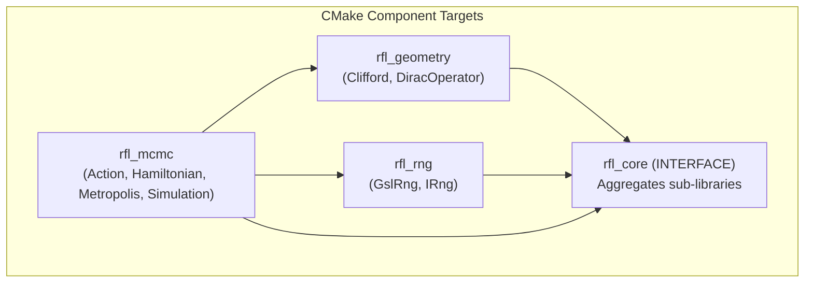

# EP-3: Resource-Efficient CI/CD Pipeline & Modern Build Architecture

* **Title:** Resource-Efficient CI/CD Pipeline & Modern Build Architecture
* **Author:** Paul Druce
* **Status:** Accepted (In Progress)
* **Target Versions:** RFL v0.2.0 (Phases 1 & 2), v0.2.0 (Phases 3 & 4)
* **Date:** 2026-09-04

---

## 1. Multi-Phase Implementation Tracker

This proposal spans the delivery of the `v0.2.0` infrastructure milestone.
The table below tracks the status of each implementation phase:

| Phase | Scope & Deliverables | Target Version | PR / Issue | Status |
| :--- | :--- | :--- | :--- | :--- |
| **Phase 1** | Tier 1 Fast PR Gate (Ubuntu + macOS, path filtering, `ci-gate`) | `v0.2.0` | [#19](https://github.com/pauldruce/RFL/issues/19), [#23](https://github.com/pauldruce/RFL/issues/23), [PR #42](https://github.com/pauldruce/RFL/pull/42) | ✅ Completed |
| **Phase 2** | Build Consolidation (CMake single source of truth, `mise.toml`, Please retirement) | `v0.2.0` | [#23](https://github.com/pauldruce/RFL/issues/23) | 🔄 In Progress |
| **Phase 3** | Dependency decoupling using CMake `FetchContent` & system packages | `v0.2.0` | [#22](https://github.com/pauldruce/RFL/issues/22) | 💡 Planned |
| **Phase 4** | Native Windows MSVC CI runner & binary wheel automation | `v0.2.0` | [#21](https://github.com/pauldruce/RFL/issues/21) | 💡 Planned |

---

## 2. Motivation, Goals & Non-Goals

### 2.1 Problem Statement & Research Context
`RFL` requires continuous validation across multiple operating systems (Ubuntu, macOS, Windows) and scientific libraries (Armadillo, GSL, OpenBLAS).
Historically, the repository suffered from two major build and CI bottlenecks:

1. **Uncoordinated, Heavy Workflows:**
   * `build_and_test.yml` executed on every branch push across three operating systems.
   * `compatability_tests.yml` executed an un-cached 15-job matrix on every pull request.
   * Documentation changes triggered full C++ compilation matrices, delaying research feedback by 15 to 25 minutes.

2. **Build-System Duality & Windows Friction:**
   * The project maintained parallel build systems: `CMakeLists.txt` for external users and `BUILD.plz` for Please build.
   * Every source file, header, and test required dual maintenance across both systems.
   * Please build added operational friction on macOS and obstructed native Windows MSVC CI runners.
   * Python wheel builds in Please wrapped `python -m build`, which invoked `scikit-build-core` and CMake anyway.

A unified build and CI architecture is required.
It must deliver sub-2-minute feedback on pull requests and eliminate dual-system maintenance.
It must also provide native Windows MSVC compatibility for `v0.2.0`.

### 2.2 Goals
* **Sub-2-Minute Dual-Platform PR Feedback:** Validate Ubuntu and macOS runners on pull requests in under two minutes using system packages.
* **Near-Zero Compute for Documentation:** Ensure documentation changes consume zero C++ compilation runner minutes.
* **Exhaustive Mainline Verification:** Execute the full 15-job compatibility matrix when code merges into `main`.
* **Single Source of Truth:** Standardise on modern CMake (3.24+) as the single build system across all platforms.
* **Unified Developer Interface:** Use `mise` (`mise.toml`) as a lightweight local task runner, replacing custom Please rules.
* **Retire Please Build:** Phase out `BUILD.plz`, `.plzconfig`, and the Please wrapper script.
* **Modular CMake Targets:** Decompose `rfl_core` into modular component targets with precompiled headers (PCH) for fast incremental rebuilds.
* **Cross-Platform Compiler Caching:** Integrate `ccache` with `/Z7` debug format on Windows to ensure high cache hit rates across runners.
* **Decoupled Dependencies:** Replace custom SourceForge build scripts with system package managers and CMake `FetchContent`.

### 2.3 Non-Goals
* Managing self-hosted GitHub Actions runners (standard GitHub-hosted runners remain sufficient).
* Replacing CMake with another specialised monorepo tool (such as Bazel or Meson).
* Implementing distributed build caching across private networks.

---

## 3. Research Workflows & Scientific Requirements

### 3.1 Core Research Scenarios
1. **Scenario 1 (Rapid Documentation and Theoretical Derivation Updates):** A researcher updates scientific derivations in `docs/` or notes in `.agents/`. The CI pipeline runs fast markdown checks. It completes in seconds without launching C++ compilers.
2. **Scenario 2 (High-Frequency MCMC Algorithm Development):** A developer refactors Dirac operator routines in `src/RFL/core/`. The Tier 1 gate builds on Ubuntu and macOS using system packages and CMake, executing unit tests in under two minutes.
3. **Scenario 3 (Exhaustive Mainline Verification):** When a pull request merges into `main`, GitHub Actions runs all 15 matrix permutations. This verifies complete release health.
4. **Scenario 4 (Cross-Platform Local Development):** A researcher clones the repository on macOS, Linux, or Windows. Running `mise run test` configures CMake with Ninja, compiles changed units, and runs tests.

### 3.2 Functional Requirements & Invariants

| Requirement ID | Requirement Summary | Operational & Physical Invariant |
| :--- | :--- | :--- |
| **REQ-CI-001** | **Fast Dual-Platform PR Gate** | Tier 1 pull request checks must validate Ubuntu and macOS in under 120 seconds using system packages. |
| **REQ-CI-002** | **Zero-Compute Documentation PRs** | Commits touching only `.md`, `docs/`, `.agents/`, or meta files must trigger zero C++ build jobs. |
| **REQ-CI-003** | **Branch Protection Integrity** | Path-filtered workflows must report passing status checks to GitHub to prevent pull request deadlocks. |
| **REQ-CI-004** | **Exhaustive Mainline Verification** | Every commit pushed or merged into `main` must execute the full 15-job compatibility matrix. |
| **REQ-CI-005** | **Compiler Object Caching** | Unchanged C++ translation units must hit `ccache` caches with an average cache-hit rate exceeding 70%. |
| **REQ-CI-006** | **Single Build Definition** | All C++ libraries, tests, and bindings must be declared strictly within `CMakeLists.txt`. |
| **REQ-CI-007** | **Unified Task Interface** | Developer tasks must be defined in `mise.toml` with zero toolchain drift across developer systems. |
| **REQ-CI-008** | **Native Windows Compatibility** | All build targets and tests must compile cleanly under Windows MSVC without emulation or WSL. |
| **REQ-CI-009** | **Direct Python Packaging** | Python wheels must build directly using `scikit-build-core` without nested intermediate build tools. |

---

## 4. Architecture Decision Records (ADRs) & Trade-offs

### 4.1 ADR-1: Execution Topology (Tiered CI with Dual-Platform PR Smoke Test)

| Criteria | Option A: Monolithic 15-Job Matrix on PR | Option B: Fast 2-Platform PR Gate + Full Matrix on Main (Selected) | Option C: Linux-Only PR Gate |
| :--- | :--- | :--- | :--- |
| **PR Turnaround Time** | ❌ 15–25 minutes | ✅ **< 2 minutes** | ✅ < 1.5 minutes |
| **Runner Minute Cost** | ❌ 60–90 minutes per PR | ✅ **3–5 minutes per PR** | ✅ 1–2 minutes per PR |
| **Early macOS/Linux Detection** | ✅ High | ✅ **High (Catches 99% of POSIX/Clang divergence)** | ❌ None (macOS issues delayed) |
| **Exhaustive Verification Gate** | On every PR commit | ✅ **On every commit to `main`** | On every commit to `main` |
| **Decision** | Rejected | **Selected (Option B)** | Rejected |

*Rationale:* Personal repositories cannot use native GitHub Merge Queues. Option B provides the optimal balance. Pull requests test Ubuntu and macOS with fast system packages (`apt` / `brew`). This catches compiler issues within 2 minutes. The full 15-job combination matrix runs automatically upon push to `main` to verify complete matrix compatibility.

---

### 4.2 ADR-2: Path Filtering Strategy

| Criteria | Option A: Top-Level `paths-ignore` | Option B: Job-Level Path Evaluator (Selected) | Option C: Commit Message Tokens |
| :--- | :--- | :--- | :--- |
| **Branch Protection Compatibility** | ❌ Fails (Skipped workflows leave checks pending) | ✅ **Guaranteed (Workflow executes and reports green check)** | ⚠️ Unreliable (Requires manual developer action) |
| **Granularity** | ⚠️ Binary (Entire workflow skips) | ✅ **Multi-category (Docs, Python, Core C++)** | ❌ Single string matching |
| **Reliability** | ✅ High | ✅ **High** | ❌ Poor (Developers forget `#docs` token) |
| **Decision** | Rejected | **Selected (Option B)** | Rejected |

*Rationale:* Top-level `paths-ignore` causes pull requests to hang if repository branch protection enforces required status checks. Using a job-level path filter (`dorny/paths-filter`) allows the workflow to execute, dynamically skip compilation jobs, and immediately report a successful status check.

---

### 4.3 ADR-3: Dependency Management in CI Runners

| Criteria | Option A: SourceForge Tarball Compilation | Option B: System Package Managers (`apt`/`brew`) | Option C: CMake `FetchContent` Fallback |
| :--- | :--- | :--- | :--- |
| **Setup Duration** | ❌ 3–5 minutes per runner | ✅ **5–10 seconds per runner** | ⚠️ 1–2 minutes (cached) |
| **Mirror Availability** | ❌ Unreliable (SourceForge timeouts) | ✅ **High (Local GitHub runner mirrors)** | ✅ High (Git mirror) |
| **Cleanliness** | ❌ Pollutes global `/usr/local` | ✅ Cleanly tracked by OS | ✅ Contained in build directory |
| **Multi-Version Flexibility** | ✅ High (Compiles any tag) | ⚠️ Limited to distro package | ✅ **High (Pulls any Git commit/tag)** |
| **Decision** | Rejected | **Selected for Tier 1 Gate** | **Selected for Tier 2 & FetchContent** |

*Rationale:* Recompiling Armadillo from SourceForge on every job wastes thousands of compute minutes annually. Tier 1 gates use system packages (`libarmadillo-dev`, `brew install armadillo`) for instant setup. Tier 2 compatibility matrices use CMake `FetchContent` and `ccache` to test specific library versions cleanly.

---

### 4.4 ADR-4: Unified Build System Architecture (Modern CMake + Mise over Please Build)

| Criteria | Option A: Please Build Everywhere | Option B: Dual Build (`CMake` + `Please`) | Option C: Modern CMake + Mise (Selected) |
| :--- | :--- | :--- | :--- |
| **Single Source of Truth** | ❌ No (CMake still required for external users) | ❌ No (Double maintenance of every file) | ✅ **Yes (`CMakeLists.txt` only)** |
| **Platform Symmetry** | ⚠️ Asymmetric (WSL required for Windows) | ⚠️ Divergent (Ubuntu Please, macOS CMake) | ✅ **100% Identical (Linux, macOS, Windows)** |
| **Windows MSVC Support** | ❌ High friction / Unsupported | ❌ High friction | ✅ **Native & Proven** |
| **Developer Task CLI** | ✅ Native (`plz build`, `plz test`) | ⚠️ Mixed | ✅ **Uniform via `mise` (`mise run test`)** |
| **Python Wheel Integration** | ⚠️ Nested wrapper around CMake | ⚠️ Nested wrapper around CMake | ✅ **Direct (`scikit-build-core`)** |
| **Rebuild Latency** | ✅ < 1 second (`.plz-cache`) | ⚠️ Variable | ✅ **< 2 seconds (`ccache` + Ninja)** |
| **Decision** | Rejected | Rejected | **Selected (Option C)** |

*Rationale:* Please build was introduced as an experiment in build graph pruning. However, maintaining two parallel build systems (`CMakeLists.txt` and `BUILD.plz`) adds heavy maintenance overhead. Furthermore, Please obstructs native Windows MSVC CI support and wraps `scikit-build-core` in an unnecessary layer. Modern CMake (3.24+) with Ninja, Precompiled Headers, and `ccache` delivers sub-2-second rebuilds. Mise provides a unified developer CLI without requiring custom build graph rules.

---

### 4.5 ADR-5: CI Status Check Enforcement & Branch Protection Strategy

| Criteria | Option A: Aggregate Gatekeeper (`ci-gate`) (Selected) | Option B: Require Individual Matrix Jobs |
| :--- | :--- | :--- |
| **Doc-Only Safety** | ✅ **100% Safe (Evaluates skipped jobs as successful)** | ❌ **Deadlocks on doc-only PRs** |
| **Settings Maintenance** | ✅ **Zero maintenance (Only one check name required)** | ❌ High (Breaks whenever matrix changes) |
| **PR Clarity** | ✅ Single decisive status badge | ❌ Many confusing status items |
| **Decision** | **Selected (Option A)** | Rejected |

*Rationale:* Branch protection on `main` requires a single aggregate status check: `ci-gate`. This job evaluates the results of all upstream PR gate jobs. If jobs are safely skipped due to path filtering, `ci-gate` reports success. If any executed job fails, `ci-gate` fails and blocks merging.

---

### 4.6 ADR-6: Pipeline Phase Separation (Pre-Build Gate vs. Build vs. Post-Build Test)

| Criteria | Option A: Monolithic Build-and-Test Script | Option B: Tri-Stage Phase Separation (Selected) |
| :--- | :--- | :--- |
| **Fail-Fast Latency** | ❌ 5–10 minutes (Fails linting after compilation) | ✅ **5–15 seconds (Fails linting before compilation)** |
| **Compute Conservation** | ❌ Compiles code even if syntax or spelling is broken | ✅ **Zero compilation spent on unformatted code** |
| **Artifact Portability** | ⚠️ Unstructured binary artefacts | ✅ **Structured exports for downstream test suites** |
| **Decision** | Rejected | **Selected (Option B)** |

*Rationale:* Splitting the pipeline into distinct phases ensures that fast pre-build checks (formatting, spelling, path evaluation) stop execution before expensive C++ compilers spin up. Building binary artefacts once and testing across environments eliminates duplicate C++ compilation.

---

## 5. Target Architecture & Component Contracts

### 5.1 Workflow Topology

```
.github/workflows/
├── ci.yml                     # Tier 1: Fast Dual-Platform PR Gate (Ubuntu + macOS, CMake + ccache, < 2 min)
├── compatability_tests.yml    # Tier 2: Exhaustive Matrix (On push to main, workflow_dispatch)
├── linter.yml                 # Code style & formatting (Clang-format on src/RFL and playground)
├── codeql.yml                 # Security scanning (Main branch and PRs to main)
└── release.yml                # Binary wheels and PyPI publishing (Tag push and release PRs)
```

---

### 5.2 Modular CMake Target Architecture

To prevent full rebuilds when modifying leaf source files, `src/RFL/core/CMakeLists.txt` decomposes the monolithic `rfl_core` into modular component targets:



1. **Target Isolation:** Editing a file in `rfl_mcmc` only recompiles that specific `.cpp` file. Unrelated component targets remain untouched.
2. **Precompiled Headers (PCH):** Precompiling heavy scientific headers (`<armadillo>`, `<gsl/...>`, `<vector>`, `<complex>`) cuts compilation time by up to 70%:
   ```cmake
   target_precompile_headers(rfl_core
       INTERFACE
           <armadillo>
           <gsl/gsl_rng.h>
           <vector>
           <complex>
           <memory>
   )
   ```
3. **CTest Labels for Targeted Execution:** Tests are tagged by component for selective execution:
   ```cmake
   set_tests_properties(GeometryTests PROPERTIES LABELS "Geometry")
   set_tests_properties(McmcTests PROPERTIES LABELS "MCMC")
   ```

---

### 5.3 Python Packaging Architecture (`scikit-build-core`)

Python extension packaging uses `scikit-build-core` in `src/RFL/pyproject.toml`, pointing directly to `CMakeLists.txt`:
```toml
[build-system]
requires = ["scikit-build-core>=0.8.0", "setuptools-scm>=8.0", "pybind11", "numpy"]
build-backend = "scikit_build_core.build"

[tool.scikit-build]
cmake.source-dir = "."
build-dir = "build/{wheel_tag}"

[tool.scikit-build.cmake.define]
CMAKE_CXX_COMPILER_LAUNCHER = "ccache"
```
This configuration eliminates intermediate build wrappers and passes the `ccache` compiler launcher directly into Python wheel builds.

---

### 5.4 Unified Developer Interface with Mise (`mise.toml`)

[Mise](https://mise.jdx.dev/) replaces the Please command-line interface. It manages development tools and defines reproducible project tasks:

```toml
[tools]
cmake = "3.31"
ninja = "1.12"
ccache = "4.10"
python = "3.12"

[tasks.build]
description = "Configure and build RFL C++ targets"
run = "cmake -B build -S src/RFL -G Ninja -DCMAKE_BUILD_TYPE=Release && cmake --build build"

[tasks.test]
description = "Execute all CTest unit tests"
depends = ["build"]
run = "ctest --test-dir build --output-on-failure"

[tasks.lint]
description = "Check C++ source formatting using clang-format"
run = "clang-format --dry-run -Werror src/RFL/**/*.cpp src/RFL/**/*.hpp"

[tasks.format]
description = "Format all C++ source files using clang-format"
run = "clang-format -i src/RFL/**/*.cpp src/RFL/**/*.hpp"

[tasks.dev]
description = "Install editable Python bindings"
run = "pip install -e src/RFL --no-build-isolation"
```

Developers run identical commands across Linux, macOS, and Windows.

---

### 5.5 Compiler Caching & Windows MSVC Configuration

1. **Compiler Launcher:** CMake enables `ccache` automatically using `CMAKE_CXX_COMPILER_LAUNCHER=ccache`.
2. **Windows MSVC Debug Information Format:**
   To enable compiler caching under MSVC on Windows runners, CMake configures embedded debug symbols (`/Z7`):
   ```cmake
   if(MSVC)
       set(CMAKE_MSVC_DEBUG_INFORMATION_FORMAT "Embedded")
   endif()
   ```
   This prevents `.pdb` lock contention and delivers high cache-hit rates on Windows.

---

### 5.6 Workflow Configuration Contracts

#### 1. Tier 1: Fast Dual-Platform PR Gate (`.github/workflows/ci.yml`)
* **Triggers:** `pull_request` (targeting `main`), `workflow_dispatch`.
* **Path Filter Configuration:**
  ```yaml
  filters:
    docs:
      - 'docs/**'
      - '*.md'
      - '.agents/**'
      - 'research/**'
      - 'vault/**'
      - '.gitignore'
    code:
      - 'src/**'
      - 'playground/**'
      - 'CMakeLists.txt'
      - 'mise.toml'
      - 'third_party/**'
  ```
* **Jobs:**
  * `filter`: Evaluates changed paths in seconds using `dorny/paths-filter`.
  * `test_ubuntu`: Executes if `code == true`. Uses `apt-get install libarmadillo-dev libgsl-dev`, `ccache`, Ninja, and CMake/CTest.
  * `test_macos`: Executes if `code == true`. Uses `brew install armadillo gsl`, `ccache`, Ninja, and CMake/CTest.
  * `ci-gate`: Always runs (`if: always()`). Evaluates upstream results; reports success if code passed or if docs were skipped.

#### 2. Tier 2: Exhaustive Compatibility Matrix (`.github/workflows/compatability_tests.yml`)
* **Triggers:**
  * `push` to `main` branch (every commit/merge into `main`).
  * `workflow_dispatch` with manual parameter inputs.
* **Runner Matrix:**
  * Operating Systems: `ubuntu-latest`, `ubuntu-22.04`, `macos-latest`, `macos-14`, `windows-latest`.
  * Armadillo Versions: `11.4.4`, `12.8.4`, `14.2.2`.
  * Build Type: `Release`.
* **Optimisation:**
  * Initialise `hendrikmuhs/ccache-action` across all runners.
  * Cache Armadillo installations per OS and version using `actions/cache`.

---

## 6. Verification Matrix & Quality Gates

| Verification Gate | Command / Test Description | Acceptance Threshold |
| :--- | :--- | :--- |
| **Doc-Only PR Gate** | Push commit modifying only `docs/README.md` | PR check passes in under 30 seconds with zero C++ compilation. |
| **Core C++ PR Gate** | Push commit modifying `src/RFL/core/DiracOperator.cpp` | PR check tests Ubuntu + macOS and passes in under 120 seconds. |
| **Incremental Rebuild Speed** | Touch leaf `.cpp` file and run `cmake --build build` | Incremental compilation completes in < 2 seconds with `ccache`. |
| **Mise Test Task** | `mise run test` | Builds and executes all unit tests with 100% pass rate. |
| **C++ Linter Execution** | `mise run lint` | Evaluates C++ code formatting cleanly in < 2 seconds. |
| **Mainline Trigger** | Push commit to `main` | Automatically triggers `compatability_tests.yml` across full matrix. |

---

## 7. Phased Delivery Plan

### Phase 1: Tier 1 Fast Dual-Platform PR Gate & Path Filtering
* **Target Version:** `v0.2.0`
* **GitHub Issues:** [#19](https://github.com/pauldruce/RFL/issues/19), [#23](https://github.com/pauldruce/RFL/issues/23)
* **Status:** ✅ Completed
* **Delivered Capabilities:**
  1. Job-level path filtering using `dorny/paths-filter`.
  2. Dual-platform PR smoke testing on Ubuntu and macOS.
  3. Aggregate `ci-gate` gatekeeper job for reliable branch protection.
  4. Integration of `ccache` compiler caching across PR runners.
  5. Retired obsolete `build_and_test.yml` workflow.

### Phase 2: Build Consolidation & Mise Orchestration
* **Target Version:** `v0.2.0`
* **GitHub Issue:** [#23](https://github.com/pauldruce/RFL/issues/23)
* **Status:** 🔄 In Progress
* **Tasks:**
  1. Add `mise.toml` defining standard developer tasks (`build`, `test`, `lint`, `format`, `dev`).
  2. Update `ci.yml` Ubuntu job to use symmetric CMake + Ninja + `ccache`, matching macOS.
  3. Decompose `src/RFL/core/CMakeLists.txt` into modular component targets (`rfl_geometry`, `rfl_mcmc`, `rfl_rng`).
  4. Add Precompiled Headers (PCH) for Armadillo and GSL in `CMakeLists.txt`.
  5. Retire and remove `BUILD.plz`, `.plzconfig`, and Please build rules.

### Phase 3: Dependency Decoupling with CMake FetchContent & System Packages
* **Target Version:** `v0.2.0`
* **GitHub Issue:** [#22](https://github.com/pauldruce/RFL/issues/22)
* **Status:** 💡 Planned
* **Tasks:**
  1. Update `src/RFL/cmake/Armadillo.cmake` with `FetchContent` fallback from upstream GitLab repository.
  2. Replace manual Armadillo shell scripts in Tier 2 matrix with CMake FetchContent or system packages.
  3. Remove `.github/actions/install-armadillo` composite action once decoupled.

### Phase 4: Native Windows MSVC CI Runner & Binary Wheel Automation
* **Target Version:** `v0.2.0`
* **GitHub Issue:** [#21](https://github.com/pauldruce/RFL/issues/21)
* **Status:** 💡 Planned
* **Tasks:**
  1. Add `windows-latest` runner to Tier 2 matrix.
  2. Configure MSVC compiler flags (`/std:c++17`, `/utf-8`, `/openmp`) and `/Z7` debug format in `CMakeLists.txt`.
  3. Add Windows wheel compilation (`win_amd64`) to `.github/workflows/release.yml`.
